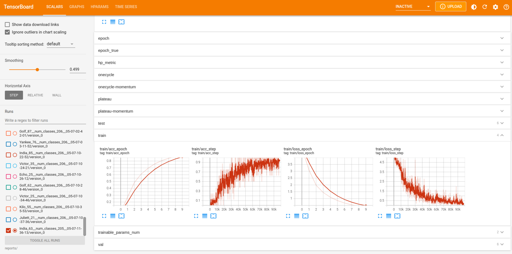
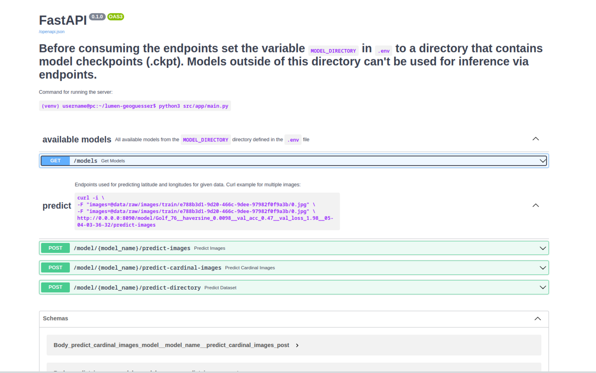

# Lumen Geoguesser

<p align="center">
	</img>
</p>

## Notices:
Although you might be reading this documentation in the form of a PDF file, **we highly recommand that you open the [README.md](README.md) file in a markdown editor** (GitHub, VSCode, PyCharm, IDE...). As for the API documentation, after setting up the environment, we recommand you run the server with the [`python3 src/app/main.py`](src/app/main.py) command after which you can inspect API endpoints in browser (and execute them too!). Essentialy, the techincal documentation PDF is rendered from the [README.md](README.md) markdown file and export of the in-browser API documentation. 

Few more notes:

- the documentation assumes you are located at the `.lumen-geoguesser` directory when running Python scripts
- all global variables are defined in [`src/config.py`](src/config.py) and [`src/paths.py`](src/utils_paths.py)
- other directories have their own `README.md` files which are hopefully
- you can run most python files with the `python3 program.py -h` to the sense of which arguments you can/must send and what the script actually does


## 📁 Directory structure

| Directory                   | Description                    |
| --------------------------- | ------------------------------ |
| [data](data/)             | dataset, csvs, country shapefiles                        |
| [models](models/)         | model checkpoints, model metadata       |
| [references](references/) | research papers and competition guidelines |
| [reports](reports/)       | model stat's, figures          |
| [src](src/)               | python source code             |


##  Setup

### Virtual environment
Create and populate the [virtual environment](https://docs.python.org/3/library/venv.html#:~:text=A%20virtual%20environment%20is%20a,part%20of%20your%20operating%20system). Simply put, the virtual environment allows you to install Python packages only for this project (which you can easily delete later). This way, we won't clutter your global Python packages.

**Step 1: Execute the following command:**
  - the command will initialize the `venv` if it doesn't yet exist
```bash
[ ! -d "venv" ] && (echo "Creating python3 virtual environment"; python3 -m venv venv)

pip install -r requirements.txt
```

### Dataset setup

This project allows multiple datasets, therefore multiple dataset directories can usually be sent to `*.py` programs 

**Step 1: Rename directory `data` to `images`**
- The original dataset strucutre has a directory `data` (e.g `dataset_original_subset/data`) which contains subdirectories with uuids of locations (`dataset_original_subset/data/6bde8efe-a565-4f05-8c60-ae2ffb32ee9b`).

Dataset structure should look like this:

```default
dataset_original_subset/
├── images
│   ├── 6bde8efe-a565-4f05-8c60-ae2ffb32ee9b
│   │   ├── 0.jpg
│   │   ├── 180.jpg
│   │   ├── 270.jpg
│   │   └── 90.jpg
│   ├── 6c0ed2ea-b31b-4cfd-9828-4aec22bc0b37
│   │   ├── 0.jpg
│   │   ├── 180.jpg
│   │   ...
│   ...
└── data.csv


dataset_external_subset/
├── images
│   ├── e61b6e5f-db0d-4f57-bbe3-4d31f16c5bc3
│   │   ├── 0.jpg
│   │   ├── 180.jpg
│   │   ...
│   ...
└── data.csv
```
**Step 2: Setup datasets with [`src/preprocess_setup_datasets.py`](src/preprocess_setup_datasets.py)**
- Before running other scripts you have to properly setup new dataset structure using the [`src/preprocess_setup_datasets.py`](src/preprocess_setup_datasets.py) file. It's important to note that this file accepts multiple dataset directories as an argument and it will make sure to merge the datasets correctly. No changes will be done to your original directories.

```default
python3 src/preprocess_setup_datasets.py -h

usage: preprocess_setup_datasets.py [-h] [--dataset-dirs dir [dir ...]] [--out-dir dir] [--copy-images] [--spacing SPACING]

optional arguments:
  -h, --help            show this help message and exit
  --dataset-dirs dir [dir ...]
                        Dataset root directories that will be transformed into a single dataset
  --out-dir dir         Directory where compelte dataset will be placed
  --copy-images         Copy images from dataset directories to the new complete directory.
                        You don't need to do this as later on you will be able to pass multiple dataset directories to various scripts.
  --spacing SPACING     
                        Spacing that will be used to create a grid of polygons.
                        Different spacings produce different number of classes
                        0.7 spacing => ~31 classes
                        0.5 spacing => ~55 classes
                        0.4 spacing => ~75 classes
                        0.3 spacing => ~115 classes
```

Example of running the initial setup script:

```sh
python3 src/preprocess_setup_datasets.py --dataset-dirs data/dataset_original_subset data/dataset_external_subset --out-dir data/dataset_complete_subset
```

`preprocess_setup_datasets.py` does all the necessary preprocessing. However, underneath the hood it calls other preprocessing scripts. What happens when you run this script?

1. directory of the new (complete) dataset is created, images are copied if `--copy-images` flag was passed
2. `preprocess_csv_concat.main()` is called which concatenates multiple `data.csv`s into a single `data.csv`
3. this new (complete) `data.csv`  is enriched by `preprocess_csv_create_rich_static.main()`. Here, regions (future classes) and their information (centroids, crs centroids...) are attached to each location. Enriched data is saved to a _Rich static CSV_ file created called `data_rich_static__spacing_<float>_classes_<int>`.
4. Directory `images` in all directories (including the `complete` one) will be split into `train`, `val` and `test` directories. Note: directory `images` won't be deleted.


New dataset structure:

```default
dataset_complete_subset/
├── data.csv
├── images <= exists if the --copy-images flag was passed
└── data_rich_static__spacing_0.5_classes_55.csv


dataset_original_subset/
├── data.csv
├── images
├── test
│   ├── c4a74f0d-7f30-4966-9b92-f63279139d68
│   │   ├── 0.jpg
│   │   ├── 180.jpg
│   │   ...
│   ...
├── train
└── val


dataset_external_subset/
├── data.csv
├── images
├── test
├── train
└── val
```

## Training

After you prepared that new dataset structure you can start the _quick version_ of training:
```sh
python3 src/train.py --dataset-dirs data/dataset_external_subset/ data/dataset_original_subset/ \
--csv-rich-static data/dataset_complete_subset/data_rich_static__spacing_0.7_classes_31.csv \
--quick
```

`--csv-rich-static` can be left out which fill force the _Rich static CSV_ creation in the runtime (this will somewhat slow down the initial setup). You can perform the full training by removing the `--quick` flag. Some additional interesting arguments are listed below. Run the `python src/train.py -h` command to see all supported arguments. 
```default
--image-size
--num-workers
--lr
--dataset-dirs [dir1, dir2, ...]
--csv-rich-static
--unfreeze-blocks
--pretrained
--quick
--batch-size
--optimizer
--regression
```

Example of production training (in our case):
```bash
python3 src/train.py \
--accelerator gpu --devices 1 --num-workers 32 \
--dataset-dir data/raw/ data/external/ \
--csv-rich-static data/complete/data_huge_spacing_0.21_num_class_211.csv \
--batch-size 8 --image-size 224 --lr 0.00002 \
--unfreeze-at-epoch 1 --scheduler plateau
```

During the training a few things will occur in the [`reports/`](reports/) directory:


1. `reports/train_*.txt` files will be create which log everything that's outputted to the standard output
2. subdirectory `reports/<model_name>` will be created in which:
    1. `data_runtime.csv` will be created, serves as backup
    2. `version/0` directory which contains:
        1. `hparams.yaml`: details of hyperparameters
        2. `events.out.tfevents*`: log file which tensorboard consumes
        3. `checkpoints`: the most important subdirectory, contains model checkpoints (trained models)

```default
reports/<model_name>/
├── data_runtime.csv
└── version_0
    ├── checkpoints
    │   ├── mymodel_checkpoint1.ckpt
    │   └── mymodel_checkpoint2.ckpt
    ├── events.out.tfevents.*
    └── hparams.yaml
```

## Logs - Tensorboard

Tensorboard logging is enabled by default. To see training and validation logs, run the command bellow. Logs should be available in browser at `http://localhost:6006/`. For more options check `tensorboard -h`.
```bash
tensorboard --port 6006 --logdir reports/
```
{width=30%}


## Local server

Local server is useful when you are trying to do inference on a trained model. The sever code and config live in [`src/app`](src/app) directory.

Before running the sever set the variable `MODEL_DIRECTORY` in [`src/app/.env`](src/app/.env) to a directory which contains (or will contain) model checkpoints (`.ckpt`). Models outside of this directory can't be used for inference via endpoints. We recommend creating new directory called `models` and copying model checkpoint files (e.g. `reports/<model_name>/version_0/checkpoints/mymodel.ckpt`) to this directory.

**Step 1. copy model checkpoints to /models/**
```bash
mkdir models
cp -r reports/<model_name>/version_0/checkpoints/* models/
```

**Step 1.1. ensure that the `MODEL_DIRECTORY` variable is set in [`src/app/.env`](src/app/.env) file**:
```bash
cat src/app/.env
```

**Step 2. run the server**:
```bash
python3 src/app/main.py
```


