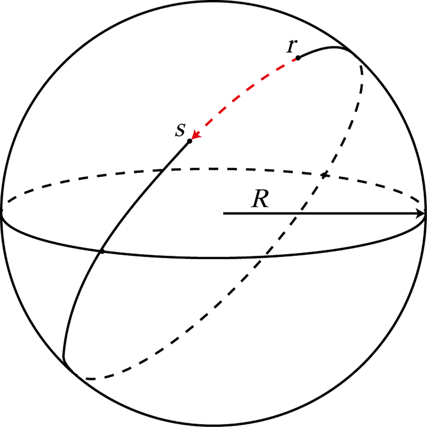
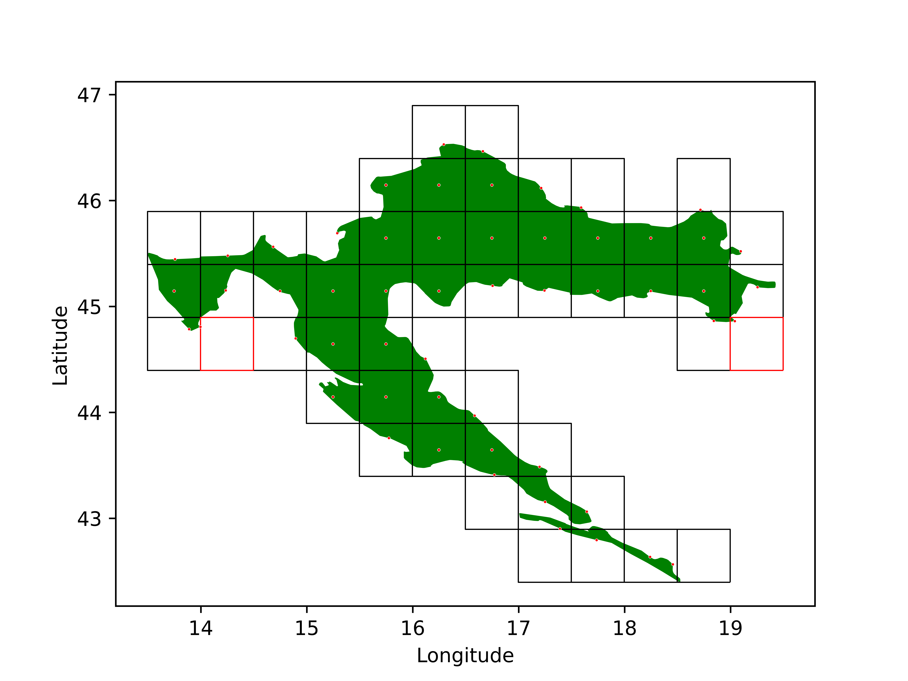

---
# to transform this file to .pdf run the following command: pandoc --standalone --toc  docs/documentation.md --pdf-engine=xelatex --resource-path=docs -o docs/pdf-documentation.pdf

# https://pandoc-discuss.narkive.com/m4QmhNgm/fetch-images-when-creating-pdf
title: Documentation

mainfont: DejaVuSerif.ttf
sansfont: DejaVuSans.ttf
monofont: DejaVuSansMono.ttf 
mathfont: texgyredejavu-math.otf
mainfontoptions:
- Extension=.ttf
- UprightFont=*
- BoldFont=*-Bold
- ItalicFont=*-Italic
- BoldItalicFont=*-BoldItalic

output:
	pdf_document:
		toc: yes
		toc_depth:

geometry: margin=3cm
numbersections: true
---

{ width=150; margin=auto }

\pagebreak

# The Problem

## Introduction

We were given a set of _Google Street View_ images taken on Croatian roads and were tasked with determining their coordinates. This problem was inspired by the popular online game [_GeoGuessr_](https://en.wikipedia.org/wiki/GeoGuessr). In the game, you are positioned at a random location using Google Street View for which you have to determine its location. Our task in this competition is slightly different. The images we were given came in quadruples forming a non-continuous 360° view of the location, meaning that they can't be connected together to from a perfect 360° panorama. Each image represents a cardinal direction (north, south, west, east) from the perspective of the Street View car. Alongside the images themselves, we also received their locations in the form of latitude and longitude pairs for each set of four image.

{width=25%}
{width=25%}
{width=25%}
{width=25%}
\begin{figure}[!h]
\caption{Example of four Google Street View images taken in a single location. Our model will train on these images.}
\end{figure}

As we previously stated, our task is to predict the coordinates of the images, specifically, the coordinates of the test images we will receive in the last week of the competition. It's important to note that we will not receive the true coordinates for these test images. After providing predicted coordinates for each set of four images, the total error is measured using the [**great-circle distance**](https://en.wikipedia.org/wiki/Great-circle_distance) between the predicted and true coordinates. The great-circle distance measures the distance between two points over a curved surface, e.g. the distance between two cities on the Earth’s curved surface, and it uses the _haversine formula_ to calculate this. Total error is calculated as the mean of all great-circle distances between the true and predicted coordinates for all the images. It's also possible to explain the error in the following way: the further a bird needs to fly from the predicted coordinates to the true coordinates, the larger the error. The total error will be used to determine how successful one method is compared to others.

{ width=50%; margin=auto }

On paper, the problem sounds fairly simple and is not unlike many other computer vision tasks. However, we are faced with the following problem: a country can look very similar over large swathes of land. For example, if we were randomly placed somewhere in the area of [Slavonia](https://en.wikipedia.org/wiki/Slavonia) and were told to say where we are located exactly, it might feel impossible to predict our exact (or even approximate) location. Unless we’ve already seen the landscape or we notice some obvious features of the location, such as a town sign or a famous landmark, there is little chance for us to correctly predict our whereabouts. There is a silver lining to this though. Croatia, although small, is very geologically and culturally diverse. Mountains, houses, forests and even fields can look different depending on the region of the country, giving precedence to the idea that the model could learn to spot these differences. That being said, it is nonetheless a difficult problem to solve and requires clever feature engineering and a careful neural network setup in order to work, which we will talk about in the coming chapters.

## Computer Vision

Computer vision is an area of research that has arguably seen the most growth from the advent of deep learning. Over the past decade, it grew from a niche research area to one of the most widely applicable fields within machine learning. In computer vision, we use neural networks to analyze a large number of images, extract some potentially useful information from them, and use that information to classify those images into predefined classes or predict a target variable. The problem we were tasked with solving in this competition falls neatly into this category.

What makes computer vision distinct from other fields of deep learning is its usage of **convolutional neural networks**. Because of the fact that images are 2-dimensional data structures, we can’t just turn them into 1-dimensional vectors for training without inducing major information loss. Due to this, CNNs use 2D _filters_ to capture image information. A filter is a matrix of learnable weights that slides across images to detect patterns. Ideally, each filter in a CNN layer would specialize in learning different image features, such as lines and contours, or eyes of animals. By stacking multiple layers of these filters, each layer can learn a higher order of abstraction of image data. For instance, the first layer might only learn to recognize simple lines. The second layer might combine these lines into shapes, while the third layer could finally combine these shapes into something recognizable. Such an architecture mimics how the human brain actually recognizes object by combining smaller elements into larger ones. After we have stacked enough convolutional layers for recognizing objects, we finish off the network by feeding all the results into a fully connected layer for classification or regression and train it with any generic loss function.

A large advantage of CNNs is their interpretability. The filter weights can be visualized to depict what each filter detects in an image, while network weights depict how the filters are combined. This can help in understanding how the network learns and functions. (IMG: insert filter image)

# Solution

## Technology Stack

Before diving into the various components of our model, the technology stack we used will be described briefly.

- [`python3.8`](https://www.python.org/) - the main programming language used for the project
- [`git`](https://hr.wikipedia.org/wiki/Git) – the popular version control system

Python Packages

- [`PyTorch`](https://pytorch.org/) - an open source deep learning framework based on the Torch library used for applications such as computer vision and natural language processing. Primarily developed by Facebook's AI Research lab
- [`PyTorch Lightning`](https://www.pytorchlightning.ai/) - a PyTorch framework which allowed us to skip a lot of boilerplate code and organize PyTorch code in a sensible and efficient way
- [`black`](https://github.com/psf/black) - code formatter
- [`aiohttp`](https://docs.aiohttp.org/en/stable/) - Asynchronous HTTP Client/Server for asyncio and Python. Used for sending/receiving asynchronous requests when calling Google's Street View API
- [`Pandas`](https://pandas.pydata.org/) - Python data analysis library. Used for loading, managing and decorating *.csv files
- [`geopandas`](https://geopandas.org/en/stable/) - Pandas version used for geospatial data. Used to wrangle, manage and generate geospatial data
- [`imageio`](https://imageio.readthedocs.io/en/stable/) - write and read image files
- [`isort`](https://github.com/PyCQA/isort) - sort *.py imports
- [`matplotlib`](https://matplotlib.org/) - visualization with Python
- [`NumPy`](https://numpy.org/) - mathematical functions and management of multi-dimensional arrays. Used for pretty much everything
- `requests` - a HTTP library for Python. The goal of the project is to make HTTP requests simpler and more human-friendly
- `scikit-learn` - a free machine learning library for Python. It features various classification, regression and clustering algorithms
- `Shapely` - a BSD-licensed Python package for manipulation and analysis of planar geometric objects. It is based on the widely deployed GEOS (the engine of PostGIS) and JTS (from which GEOS is ported) libraries
- `tabulate` - easy and pretty Python tables
- `tensorboard` - library used for fetching and visualizing machine learning model training data in a browser
- `tqdm` - easy Python progress bars

## Solution Architecture

Our model was composed of four main modules, as well as numerous helper functions. The helper functions were mainly tasked with tasks that were separate from the training process itself, such as transforming data into a format appropriate for training, generating classes, visualization, saving and loading, etc. In this section, we will instead focus on the four main modules and describe them in more detail.

The first module we will describe is the `GeoguesserDataModule`. It inherits the `LightningDataModule` and is used for simpler dataset loading. First, we load the dataset and perform the necessary transformations so it’s suitable for training. We then create the classes needed for classification together with their centroids, and add them to the dataset. We also perform some dataset statistics extraction, as well as some data standardization. Finally, we split the data into the train, validation and test dataset and create dataset instances that will be described in the next paragraph. We also do some sanity checking to make sure everything is in order before continuing.

To make training simpler, we define datasets for the train, validation and test part of the dataset separately. This is done by creating instances of the `GeoguesserDatset` module which inherit the standard `PyTorch Dataset`. The most important operation that this module performs, aside from saving the dataset and its information, is define what happens when an instance of the dataset is retrieved. This includes fetching the data from both the image folders and the CSV file, loading the images, making them ready for input into the neural network, and transforming them with the specified transformation.

The neural network model is defined in the model module. The different models we defined here (classification and regression) all inherit the `LightningModule` to make things as simple as possible. Each model fetches a pretrained network and changes its last layer to a layer more suitable for the model’s task. We then define each model’s `forward` function, which defines how our data is processed through all the layers of the model, and all of the training, validation and testing functions. Each function performs an iteration of training and calculates error, and in the case of validation and testing, the haversine distance function. We then log all the parameters of the model into a file for later fetching.

Finally, everything is joined together in the `train` function. Here, we parse the arguments pasts to the model, define the data transformations, the `GeoguesserDataModule`, initiate the logger, create the specified model, define our optimization algorithm and how the learning rate behaves, and finally, train the model. Optionally, we can also visualize our results after training.

# Data and Feature Engineering

This problem can be approached from two different angles. We will call them the **Classification approach** and the **Regression approach**. In the classification approach, we classify images into a fixed set of regions of Croatia in the form of a grid on the map (notice: we lose the information about the image's exact location here), while in the regression approach we try regressing the image coordinates to a continuous output from the model that will be restricted by the minimum and maximum possible coordinates (bounds of Croatia).

Because Croatia is a small country and the coordinates have a range of no more then a few degrees, we needed to normalize them. But, before doing that, there was another transformation we needed to perform. The thing is, we can’t use the haversine distance during the training process due to its slowness (it contains a lot of trigonometric operations that don’t cooperate nicely with GPU-s). But we also can’t use regular coordinates even after transforming them because the Earth’s surface is curved (even though some would want you to believe otherwise) and generic loss functions don’t take this into account. Multiple ideas were tested to solve this, including cosine transforming the coordinates, as well as projecting them into Cartesian space. Finally, we ended up using a much more elegant solution with fewer steps: the [_coordinate reference system (CRS)_](https://en.wikipedia.org/wiki/Spatial_reference_system). It transforms every coordinate on Earth’s curved surface into a different coordinate on a flat surface using a projection. The error is minimal (no more than about 1 m) and a generic loss function is directly applicable to these coordinates. Splendid! Now we simply need to find the maximum and minimum coordinates of the dataset and use them to normalize the data into a 0 – 1 range. This is done to improve training stability and simplify the output. It is worth noting that we calculate these values only on the training part of the dataset to prevent information leakage. Also, functions like the haversine distance function take as input radians, so that was also a necessary transformation.

{width=50%}
{width=50%}
\begin{figure}[!h]
\caption{Two maps of Croatia divided into distinct regions that represent classes. Red dots represent the centroids of the regions, or the point on land closest to the centroid if the centroid is at sea. The image on the right has a denser grid than the image on the left.}
\end{figure}

## Classification Approach

The set of regions of Croatia we mentioned above can be represented in the form of square polygons on a map. Each polygon corresponds to a single class and each polygon has a centroid that represents the coordinates of the class. The idea is that, instead of predicting the _exact_ coordinates of an image, the model classifies the images into regions from the previously described set of regions. Since now we don’t have specific coordinates we predicted for each set of four images, we instead declare the predicted coordinates to be the centroid of the region where the image was classified and calculate our error in regards to that centroid. Notice that the image's true coordinates might be relatively distant from the centroid of the region into which the image was classified. This error shrinks as the number of specified regions grows. An image of Croatia divided into square regions can be seen in Figure 4.

{width=50%}
{width=50%}
\begin{figure}[!h]
\caption{The image on the left depicts a class whose centroid isn’t located on land. The image on the right depicts a class that doesn’t contain any images in it.}
\end{figure}

How is this grid-like set of regions created? First, we create a grid that is located fully inside the bounds of Croatia. It contains numerous polygons (squares) which are adjacent to each other. Although we have a fixed number of polygons, not every polygon is created equal. This is because, unfortunately, some of them aren’t Croatian at all, as they don’t really intersect Croatian territory. Therefore, they shouldn’t be taken into consideration further on and are filtered out. After this is done, we proceed to the task of finding the centroids of these polygons. Using the [`geopandas`](https://geopandas.org/en/stable/) library, this problem can be reduced to a single simple expression: `polygon.centroid`. Great! Now we have a list of classes for our model. But before we continue to the next section, we should double-check what we did so far.

Let us observe the following example. Even though the centroids of the polygons were calculated correctly (they’re in the center of the squares), some of them decided to go sailing and ended up in the middle of the sea. This doesn’t make sense for our prediction, as we know for a fact that the dataset contains only images taken on land. This has to change. Therefore, we introduce _clipped centroids_. Clipped centroids are a modification of regular centroids that fix the previously stated issue by clipping the undesirable centroid to the closest possible point on land. By doing this, we reduce the error rate of the model by moving seaborne centroids closer to the image’s true coordinates, which are on land.

We have previously mentioned that it's possible to specify the number of desired classes before creating the grid and thereby make it more or less dense. By choosing a dense grid, we can essentially simulate something akin to regression. As the number of classes increases and the size of each class decreases, more polygons and centroid values are available as potential classes. A smaller class means that the theoretical maximum distance between a class’ centroid and the true image coordinates is also smaller, and therefore has the potential of decreasing the total prediction error. Note that, at the end of the day, this is what matters, not the accuracy of our class predictions, as we calculate the final error by measuring the distance between an image’s coordinates (here the class centroid) and its true coordinates. Even if we classify all images correctly, we will still have a potentially large average haversine distance because we never actually predict the true image coordinates, only the class centroids. If we take it to the extreme, which is an infinite number of classes, we can come quite close to regression, but there is a caveat. In classification models, each class needs a certain number of images to effectively train. If this number is too low, the model simply can’t extract enough meaningful information from the images of a class to ‘learn’ the features of that class.

Another problem arises because of Croatia’s unique shape. For some polygons, the intersection area with Croatia's territory is only a few tiny spots, meaning that the majority of the polygon's area ends up in a neighboring country. This isn't a major issue when using the previously defined clipped centroids, but another problem arises because there simply might not exist any images in the dataset that are located in that tiny area of the polygon that is within Croatia. And in fact, we did end up in such situations. We solved this by discarding these polygons and pretending like they didn't exist in the list of classes we could classify the images into. Fortunately, this doesn’t happen too often as the dataset is fairly large and the image’s locations are uniformly distributed.

Lastly, as with most classification approaches, we use cross entropy loss on the predicted and true classes. The true classes are represented with a one-hot encoded vector, while the predicted classes are represented with a vector of probabilities for each class. To obtain the coordinates from these probabilities, we extract the centroid information for each of the classes and multiply it by the predicted probabilities. We add everything app and end up with an average of all the predictions. This way, our final predicted image coordinates are not necessarily within our predicted class, but as our model becomes more sure in its predictions, so do these averaged coordinates come closer to the class. We have noticed that this averaging approach improves performance.

## Regression Approach

This approach is a bit more obvious. Each set of images has its target coordinate, and we task out model to predict these coordinates. Therefore, the size of the output of the model is not determined by the number of classes, but is simply 2: latitude and longitude (later, we will see that this is not quite true). We directly compare these output coordinates to the true image coordinates and calculate the error using the haversine formula. Unlike in the classification approach, the loss function we use for the model can also tell us an accurate state of our predictions, as we are not bound by an artificial limit like having classes. That being said, in practice, we noticed that this approach often performs worse than the classification approach and is also slower. It appears that the presence of classes does help the model in training somewhat.

For the loss function, we use mean squared error loss and we predict the coordinates directly, so no transformations are necessary unlike in classification. It is worth noting that these two approaches can only be compared using the haversine distance metric, as their loss functions work in very different ways and output vastly different values. Therefore, they can’t be compared during training, but only during validation and testing, as we calculate the haversine distance only then.

# Model

There are numerous approaches that are considered state-of-the-art at the moment, all using vastly different architectures. Because of readily available high performance models that were pretrained on large datasets, we chose to use one of these models instead of creating our own from scratch. Originally, we chose the EfficientNet architecture because of it showing both good performance and having lower system requirements when compared to other approaches. However, after doing some experimenting, we ended up using a version of ResNet called ResNeXt instead, as it simply proved more effective. ResNeXt is highly modular and revolves around repeating building blocks that aggregate sets of transformations. Due to this, it includes few hyperparameters that have to be adjusted for the architecture to be effective. Of course, we also had to modify these architectures in order to make them work with our dataset. There were two modifications we made.

Firstly, we removed the last layer of the network and replaced it with our own classification or regression layer in the form of a simple linear layer that had the appropriate number of output classes for our problem (this being only 2 for regression, accounting for the 2 coordinates). Secondly, because, as we mentioned before, every location contained 4 images, we modified our network to perform its forward operations for the four images in tandem and then concatenate the outputs before imputing them into the classification layer. We did this after doing some research on what was the best way to compute the outputs of separate, but statistically linked images.

# Training

## Basics

Due to using pretrained models, we first performed what is called fine-tuning. In fine-tuning, we leave the early layers of a network unchanged and only train the weights of the last few layers. ResNeXt was pretrained on ImageNet, a large image dataset with diverse objects. This gives the early layers of ResNeXt a collection of learned shapes and lines that are relatively similar to our own domain. In addition, our own dataset is much smaller than the number of ResNet parameters. If we were to train ResNet from scratch, we would quickly overfit. By using a model pretrained on a large generic dataset and then fine-tuning only the last layers, we preserve all the fine detail learned by all the early network layers and only overwrite the last layers where we essentially assemble these details into images. However, after performing fine-tuning for a sufficient time, we periodically unlock other network layers so that they can be trained along with the last few layers. By using a sufficiently small learning rate, we induce our dataset information into all the network layers without overwriting the model.

## Dataset

As previously mentioned, the dataset is divided into two components. The first one is a collection of folders each containing 4 images taken in the same location. Each folder is named with a unique identifier. The second component is a CSV table where each row contains a previously mentioned folder ID and the corresponding image’s latitude and longitude expressed in degrees. We divided the data by hand into a training, validation and testing subfolder in a 80%/10%/10% split. This way, the data can be easily loaded during the training process from the appropriate folder depending on if we are in the training, validation or testing phase. Due to the datasets (and image’s) large size, we were unable to load the whole dataset directly into memory. We wanted to do this because iy had the potential of greatly decreasing training times, but we were forced to figure out other methods of speeding up training, like using only parts of the dataset during experimentation and employing smarter learning rate schedulers.

Before the training process itself could begin, we needed to first process the data. This entailed modifying the CSV file to include data such as class affiliation, class centroid information and the image’s and centroids latitude and longitude information in CRS format. Aside from this, image information such as minimum and maximum value had to be also stored for fetching during the training process, and later, inference.

For the competition, we were provided with a dataset of around 64 000 images (16 000 separate locations of four images each), but we added our own separately procured images from Google Street View numbering around 68 000. In other words, we doubled the available data for training. In common deep learning wisdom, having more training data is the best form of regularization, this being our main guideline for gathering additional images.

## The Model Training Phase

The algorithm was composed of 3 steps. In the first step, it would go through the training dataset in batches of a specified size (usually 8, more if memory constraints allowed). The training step had to be as quick and efficient as possible because time- and processing-wise, it entailed the vast majority of the learning phase. Due to this, the haversine distance of the true and predicted image coordinates wasn’t calculated here. This not only let us skip the time consuming process of calculating the haversine distance itself, but also avoided the costly transformations of the data necessary for converting it to a format suitable for input into the haversine distance functions.

After we exhausted the training dataset (normally called an epoch), we would validate our progress on the validation part of the dataset. This is done to prevent overfitting. As the model learns on the training dataset and if the model is of a sufficient size, i.e. it has more learnable parameters than there are images in the data, it will essentially memorize all the information in the training dataset by heart and learn how to predict it perfectly. However, because it has never seen the data in the validation dataset before, it will predict it correctly only if it has a good generalization capacity. Aside from this, the validation dataset allows us to finally calculate the haversine distance for the predictions, which is the most accurate (and only true) measure of our current progress, as well as the final performance of the model. It is worth noting that during the validation process, learning is disabled, as the model’s trainable parameters are “frozen” here. Another thing to note is that the validation phase also functions as a “checkpoint” for our model. The best performing iterations of the model on the validation dataset are saved for later to be used on the testing and inference datasets.

Finally, after all the training epochs are over, meaning we went over both the training and validation dataset multiple times, we can test our model on the testing dataset. Just like the validation dataset, the test dataset has never been seen by our model before and is used as a final performance assessment. The best model found in the validation phase is used here. What makes the testing dataset special is that, during validation, we often change and test different values for hyperparameters. This is called hyperparameter tuning. During this process, some of the information from the validation dataset _leaks_ into the model, because we are essentially training the hyperparameters on the validation dataset. Due to this, at the very end, another test is performed on a separate, never before seen test dataset.

## Hyperparameters

We set the image size to either 112x112 or 56x56 pixels, depending on the model. A smaller image size would allow for larger batches and faster training, but potentially contained less information in the images due to resolution loss. Batch size itself had the purpose of regulating how fast and accurate our training was. Perfect backpropagation updates model weights only after going through all images in the entire training dataset. This usually results in the most accurate possible gradients for optimization, but has the downside of being very slow and often ending up in local optima. On the other end of the spectrum, training on only one image per batch is very fast and can easily escape local optima, but is also rather inaccurate and converges quite slowly due to imprecise gradients. The best of both worlds can be achieved by training on multiple images per batch, ideally as many as possible (actually, there is an upper limit to the number of batches one should use, but it is normally infeasibly large). Memory and GPU limitations commonly don’t allow for this, so we are forced to use the largest batch size we can (8, to be precise, for an image size of 112x112 pixels). Lowering the image resolution can give us more wiggle room in choosing batch sizes, but setting batch size too a too large value runs the risk of quickly filling up the GPU’s memory and crashing the training process midway through.

Aside from image size and batch size, another important parameter to be adjusted is learning rate. A learning rate with a too big value can converge the model to a solution quickly, but lacks fine tuning capabilities necessary for that extra edge in performance during later phases of training. On the other hand, a learning rate too small can make the training process very slow and can cause it to often end up in local minima. Ideally, we should have a large learning rate in the early staged of training, while periodically reducing it as the training moves on. The application of momentum can also help in this. Momentum is a value that is proportionally added to the learning rate during training if it is going particularly well. An optimizing algorithm that includes all of the aforementioned mechanisms is [Adam](https://arxiv.org/abs/1412.6980). We chose it due to its good balance between precision and speed during training and a built in momentum function.

## Inference

Inference is done after the entire training phase of our model is over. It is the process of testing our best performing model on never before seen images and can be described as the training phase in reverse. Instead of seeing an image’s coordinates and training our model on them, we now have to look only at the image itself and predict it’s coordinates. The true image coordinates are hidden from us and are compared against our answers without us overseeing any part of the process. This is how our model will finally be tested and compared against other models in the end to assess its final performance.

----
To do:

Datasets

- split

Connecting datasets ( data module ):

- hashing, mean, std, calculations

Training
	-
	- dataset

External sampling
