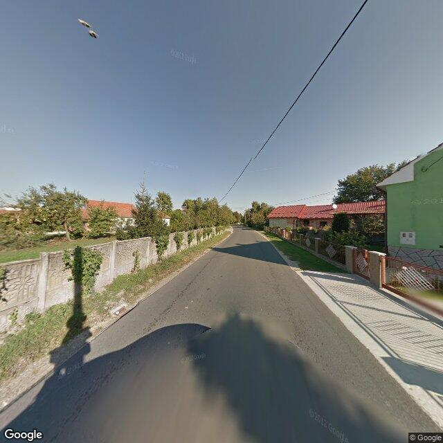
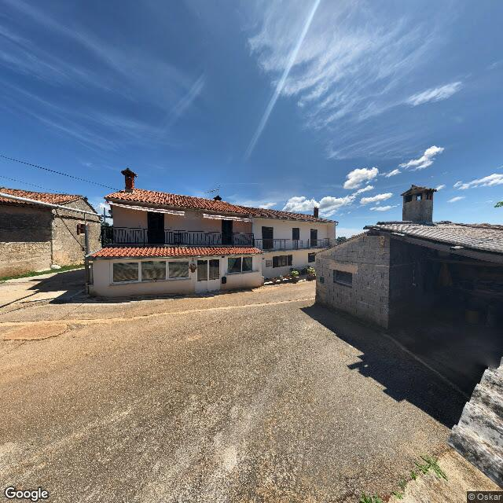
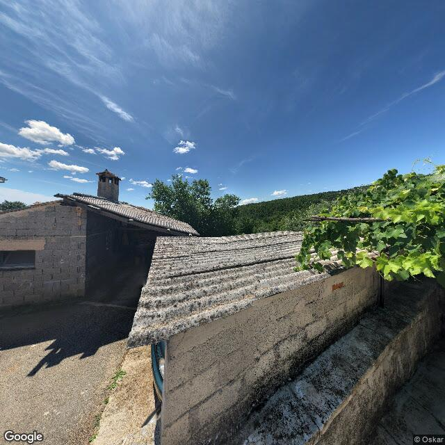
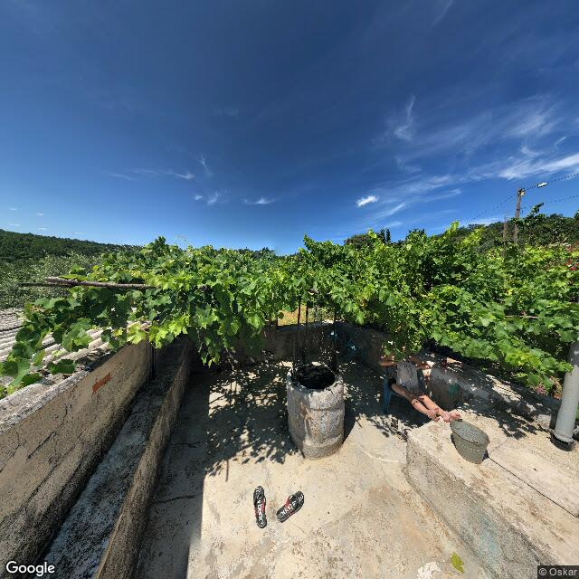
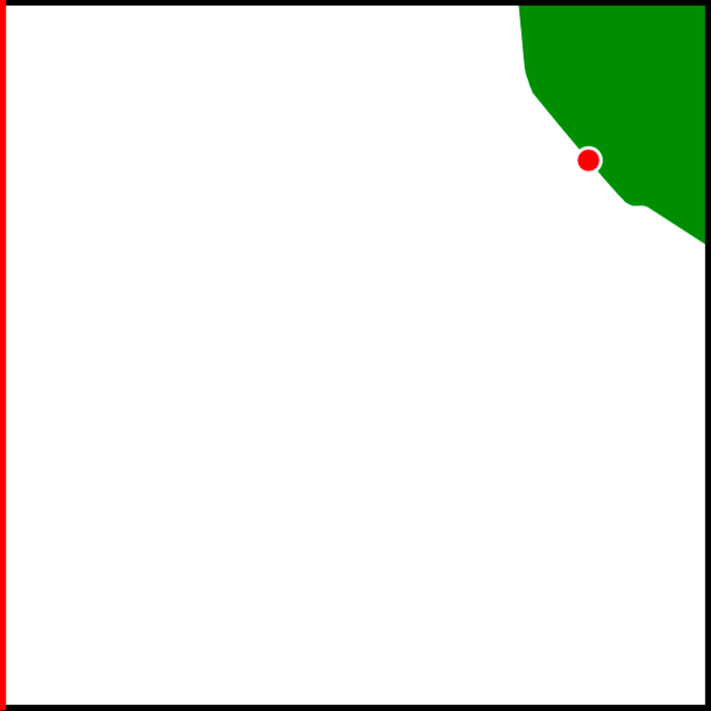
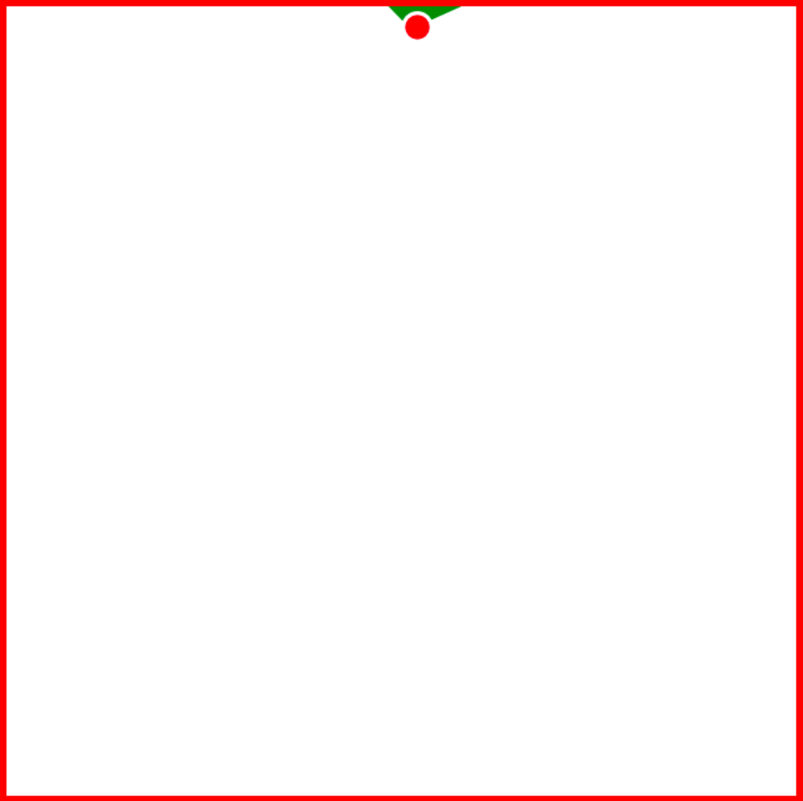
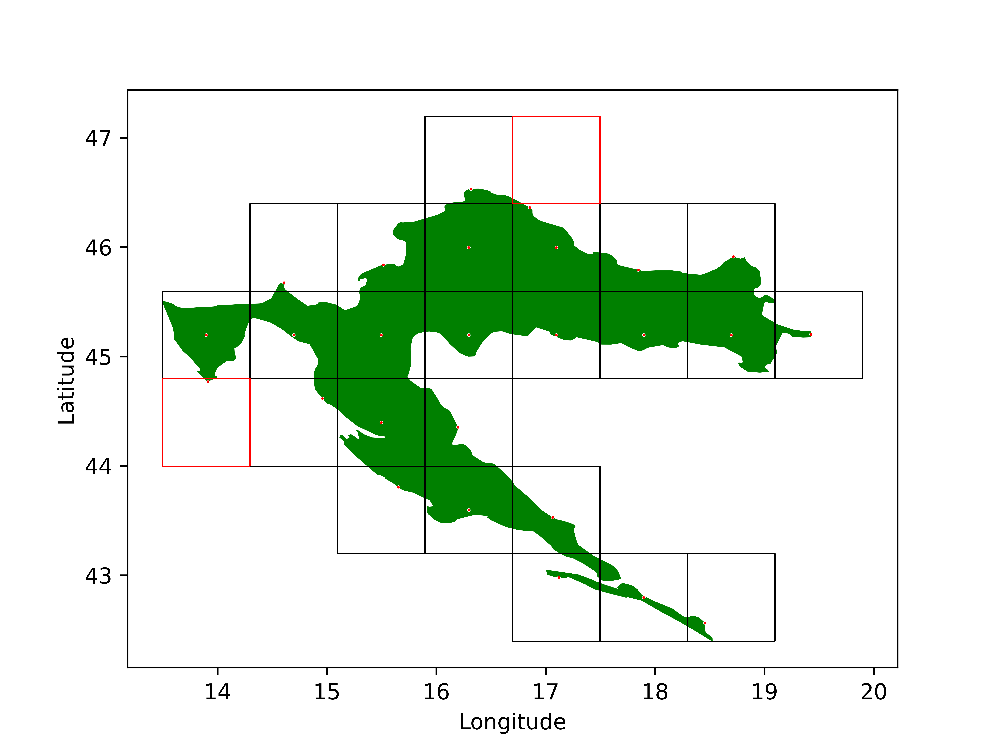

---
# to transform this file to .pdf run the following command: pandoc --standalone --toc  docs/documentation.md --pdf-engine=xelatex --resource-path=docs -o docs/pdf-documentation.pdf

# https://pandoc-discuss.narkive.com/m4QmhNgm/fetch-images-when-creating-pdf
title: Documentation

mainfont: DejaVuSerif.ttf
sansfont: DejaVuSans.ttf
monofont: DejaVuSansMono.ttf 
mathfont: texgyredejavu-math.otf

output:
	pdf_document:
		toc: yes
		toc_depth:
author:
	- Filip Wolf
	- Leonardo Čuljak
	- Borna Katović
	- Matej Ciglenečki

geometry: margin=3cm
numbersections: true
---

\pagebreak

# The problem

## Introduction

We were given a set of Google Street View images taken on Croatian roads with the task of determining their coordinates. This problem was inspired by the popular online game [GeoGuessr](https://en.wikipedia.org/wiki/GeoGuessr). In the game, you are positioned at a random location using Google Street View for which you have to infer its location. Our task in this competition is slightly different. The images we were given came in quadruples forming a non-continuous 360° view of the location. This means that the images can't be connected together to from a perfect 360° panorama. Each image represents a cardinal direction (north, south, west, east) from the Street View car. Alongside the images themselves, we also received their locations in the form of latitude and longitude pairs for each set of four image.

{width=25%}
{width=25%}
{width=25%}
{width=25%}
\begin{figure}[!h]
\caption{Example of four Google Street View images taken in a single location. Our model trains on these images.}
\end{figure}

{width=50%}
{width=50%}
\begin{figure}[!h]
\caption{The first image represents a class whose centroid isn’t on land. The second image depicts a class that doesn’t contain any images in it.}
\end{figure}

{ width=150; margin=auto }

As we previously stated, our task is to predict the coordinates of the images, specifically, the coordinates of the test images we will receive in the last week of the competition. It's important to note that we will not receive coordinates for these test images. After providing predicted coordinates for each set of four images, the error is measured using the [Great-circle distance](https://en.wikipedia.org/wiki/Great-circle_distance) between the predicted and true coordinates. The great-circle distance measures the distance between two points over a curved surface, e.g. the distance between two cities on the Earth’s curved surface, and it uses the <i>haversine formula</i> to calculate this. Total error is calculated as the mean of all the great-circle distances between the true and predicted coordinates of all the images. It's also possible to explain the error in the following way: the further a bird needs to fly from the predicted coordinates to the true coordinates, the larger the error. The total error will be used to determine how successful one method is compared to the other.

On paper, the problem sounds fairly simple and is not unlike many other computer vision tasks. However, the following problem arises: a country can look very similar over large swathes of land. If we were randomly placed somewhere in the area of [Gorski Kotar](https://en.wikipedia.org/wiki/Gorski_Kotar) it might feel impossible to predict our exact (or even approximate) location. Unless we’ve already seen the landscape or we notice some obvious features of the location, such as a town sign or a famous statue, there is little chance for us to correctly predict our whereabouts. There is a silver lining to this though. Croatia, although small, is very geologically and culturally diverse. Mountains, houses, forests and even fields can look different depending on the region of the country, giving precedence to the idea that the model could catch these differences. That being said, it is still a difficult problem to solve and requires clever feature engineering and careful neural network setups in order to work, which we will talk about in the coming chapters.

{ width=150; margin=auto }

## Computer Vision

Computer vision is an area of research that has arguably seen the most growth from the advent of deep learning. Over the past decade, it grew from a niche research area to one of the most widely applicable fields within machine learning. In computer vision, we use neural networks to analyze a large number of images, extract some potentially useful information from them, and use that information to classify those images into predefined classes or predict a number. The problem we were tasked with solving in this competition falls neatly into this category.

# Solution

## Technology stack

Before diving into various components of our model, the technology stack we used will be described briefly.

- [`python3.8`](https://www.python.org/) - the main programming language used for the project
- [`git`](https://hr.wikipedia.org/wiki/Git) - version control system

Python packages

- [`PyTorch`](https://pytorch.org/) - an open source deep learning framework based on the Torch library used for applications such as computer vision and natural language processing. Primarily developed by Facebook's AI Research lab
- [`PyTorch Lightning`](https://www.pytorchlightning.ai/) - a PyTorch framework which allowed us to skip a lot of boilerplate code and organize PyTorch code in a sensible and efficient way
- [`black`](https://github.com/psf/black) - code formatter
- [`aiohttp`](https://docs.aiohttp.org/en/stable/) - Asynchronous HTTP Client/Server for asyncio and Python. Used for sending/receiving asynchronous requests when calling Google's Street View API
- [`Pandas`](https://pandas.pydata.org/) - Python data analysis library. Used for loading, managing and decorating *.csv files
- [`geopandas`](https://geopandas.org/en/stable/) - Pandas version used for geospatial data. Used to wrangle, manage and generate geospatial data
- [`imageio`](https://imageio.readthedocs.io/en/stable/) - write and read image files
- [`isort`](https://github.com/PyCQA/isort) - sort *.py imports
- [`matplotlib`](https://matplotlib.org/) - visualization with Python
- [`NumPy`](https://numpy.org/) - mathematical functions and management of multi-dimensional arrays. Used for pretty much everything
- `requests` - a HTTP library for Python. The goal of the project is to make HTTP requests simpler and more human-friendly
- `scikit-learn` - a free machine learning library for Python. It features various classification, regression and clustering algorithms
- `Shapely` - a BSD-licensed Python package for manipulation and analysis of planar geometric objects. It is based on the widely deployed GEOS (the engine of PostGIS) and JTS (from which GEOS is ported) libraries
- `tabulate` - easy and pretty Python tables
- `tensorboard` - library used for fetching and visualizing machine learning model training data in a browser
- `tqdm` - easy Python progress bars

# Data and feature engineering

This problem can be approached from two different angles. We will call them the **Classification approach** and the **Regression approach**. In the classification approach, we classify images into a fixed set of regions of Croatia in the form of a grid on the map (notice: we lose the information about the image's exact location here), while in the regression approach we try regressing the image coordinates to a continuous output from the model that will be restricted by the minimum and maximum possible coordinates (bounds of Croatia).

Because Croatia is a small country and the coordinates have a range of no more then a few degrees, we needed to normalize them. But, before that, there was another transformation we needed to perform. The thing is, we can’t use the haversine distance during the training process due to its slowness (it contains a lot of trigonometric operations that don’t cooperate nicely with GPU-s). But we also can’t use regular coordinates even after transforming them because the Earth’s surface is curved (even though some would want you to believe otherwise) and generic loss functions don’t take this into account. Therefore, we use the <i>coordinate reference system (CRS)</i> (https://en.wikipedia.org/wiki/Spatial_reference_system). It transforms every coordinate on Earth’s curved surface into a coordinate on a flat surface using a projection. The error is minimal (no more than about 1 m) and a generic loss function is directly applicable to these coordinates. Splendid! Now we simply find the maximum and minimum coordinates of the dataset and use them to normalize the data into a 0 – 1 range. This is done to improve training stability and simplify the output. It is worth noting that we calculate these values only on the training part of the dataset to prevent information leakage.

## Classification approach

The set of regions of Croatia we mentioned above can be represented in the form of square polygons on the map where each polygon corresponds to a single class. The idea is that instead of predicting the <i>exact</i> coordinates of an image, the model classifies the images into a region from the previously stated set of regions. Since now we don’t have specific predicted coordinates for each set of four images, we instead declare the predicted coordinates to be the centroid of the region where the image was classified and calculate our error in regards to that centroid. Notice that the image's true coordinates might be relatively distant from the centroid of the region into which the image was classified. This error shrinks as the number of specified regions grows. This is represented in Figure 1.

How is this grid-like set of regions created? First, we create a grid that is located fully inside the bounds of Croatia. It contains many polygons (squares) which are adjacent to each other. Although we have a fixed number of polygons, not every polygon should be taken into consideration because some of them don’t intersect with Croatian territory. Therefore, we filter them out. After we find all the polygons that intersect with Croatia, we proceed to the task of finding the centroids of these polygons. Using the [`geopandas`](https://geopandas.org/en/stable/) library, this problem can be reduced to a single expression: `polygon.centroid`. We now have a list of classes for our model. But before we continue to the next section, we should double-check what we did.

Let us observe the following example. Even though the centroid of the polygon is calculated correctly (it’s in the center of the square), it wouldn’t make sense for our prediction that the image's coordinates are located somewhere at sea, as we know for a fact that the dataset contains only images taken on land. This has to change. Therefore, we introduce **clipped centroids**. Clipped centroids are a modification of regular centroids that fixes the previously stated issue. We do this by clipping the undesirable centroid to the closest possible point on the land. By doing this, we reduce the error rate by moving coastal centroids closer to the image’s true coordinates.

We have previously mentioned that it's possible to specify the number of desired classes before creating the grid and thereby make it more or less dense. By choosing a dense grid, we can essentially simulate something akin to regression. As the number of classes increases and the size of each class decreases, more polygons and centroid values are available as potential classes. A smaller class means that the theoretical maximum distance between a class’ centroid and the true image coordinates is also smaller, and therefore has the potential of decreasing the total prediction error. Note that, at the end of the day, this is what matters, not the accuracy of our class predictions, as we calculate the final error by measuring the distance between an image’s coordinates (here the class centroid) and its true coordinates. Even if we classify all images correctly, we will still have a potentially large average haversine distance because we never actually predict the true image coordinates, only the class centroids. If we take it to the extreme, which is an infinite number of classes, we can come quite close to regression, but there is a caveat. In classification models, each class needs a certain number of images to effectively train. If this number is too low, the model simply can’t extract enough meaningful information from the images of a class to ‘learn’ the features of that class.

Another problem arises because of Croatia’s unique shape. For some polygons, the intersection area with Croatia's territory is only a few tiny spots, meaning that the majority of the polygon's area ends up in a neighboring country. This isn't a major issue when using the previously defined clipped centroids, but another problem arises because there simply might not exist any images in the dataset that are located in that tiny area of the polygon that is within Croatia. And in fact, we did end up in such situations. We solved this by discarding these polygons and pretending like they didn't exist in the list of classes we could classify the images into. Fortunately, this doesn’t happen too often as the dataset is fairly large and the image’s locations are uniformly distributed.

Lastly, as with most classification approaches, we use cross entropy loss on the predicted and true classes. The true classes are represented with a one-hot encoded vector, while the predicted classes are represented with a vector of probabilities for each class. To obtain the coordinates from these probabilities, we extract the centroid information for each of the classes and multiply it by the predicted probabilities. We add everything app and end up with an average of all the predictions. This way, our final predicted image coordinates are not necessarily within our predicted class, but as our model becomes more sure in its predictions, so do these averaged coordinates come closer to the class. We have noticed that this averaging approach improves performance.

## Regression approach

This approach is a bit more obvious. Each set of images has its target coordinate, and we task out model to predict these coordinates. Therefore, the size of the output of the model is not determined by the number of classes, but is simply 2: latitude and longitude (later, we will see that this is not quite true). We directly compare these output coordinates to the true image coordinates and calculate the error using the haversine formula. Unlike in the classification approach, the loss function we use for the model can also tell us an accurate state of our predictions, as we are not bound by an artificial limit like having classes. That being said, in practice, we noticed that this approach often performs worse than the classification approach and is also slower. It appears that the presence of classes does help the model in training somewhat.

For the loss function, we use mean squared error loss and we predict the coordinates directly, so no transformations are necessary unlike in classification. It is worth noting that these two approaches can only be compared using the haversine distance metric, as their loss functions work in very different ways and output vastly different values. Therefore, they can’t be compared during training, but only during validation and testing, as we calculate the haversine distance only then.

# Model

There are numerous approaches that are considered state-of-the-art at the moment, all using completely different architectures. Because of readily available high performance models that were pretrained on large datasets being the norm, we also followed this route. Originally, we chose the EfficientNet architecture because of it showing both good performance and having lower system requirements when compared to other approaches. However, after doing some experimenting, we ended up using a version of ResNet instead, as it simply proved more effective. Of course, we also had to modify these architectures in order to make them work with our dataset. There were two modifications we made.

First, we removed the last layer of the network and replaced it with our own classification layer in the form of a simple linear layer that had the appropriate number of classes for our problem. Secondly, because, as we mentioned before, every location contained 4 images, we modified our network to perform its forward operations for the four images in tandem and then concatenate the outputs before imputing them into the classification layer. We did this after doing some research on what was the best way to compute the outputs of separate, but statistically linked images.

# Training

## Basics

Due to using pretrained models, we first performed what is called fine-tuning. In fine-tuning, we leave the early layers of a network unchanged and only train the weights of the last few layers. ResNet was pretrained on ImageNet, a large image dataset with diverse objects. This gives the early layers of ResNet a collection of learned shapes and lines that are relatively similar to our own domain. In addition, our own dataset is much smaller than the number of ResNet parameters. If we were to train ResNet from scratch, we would quickly overfit. By using a model pretrained on a large generic dataset and then fine-tuning only the last layers, we preserve all the fine detail learned by all the early network layers and only overwrite the last layers where we essentially assemble these details into images. However, after performing fine-tuning for a sufficient time, we periodically unlock other network layers so that they can be trained along with the last few layers. By using a sufficiently small learning rate, we induce our dataset information into all the network layers without overwriting the model.

----
To do:

Datasets

- split

Connecting datasets ( data module ):

- hashing, mean, std, calculations

Training
	-
	- dataset

External sampling
