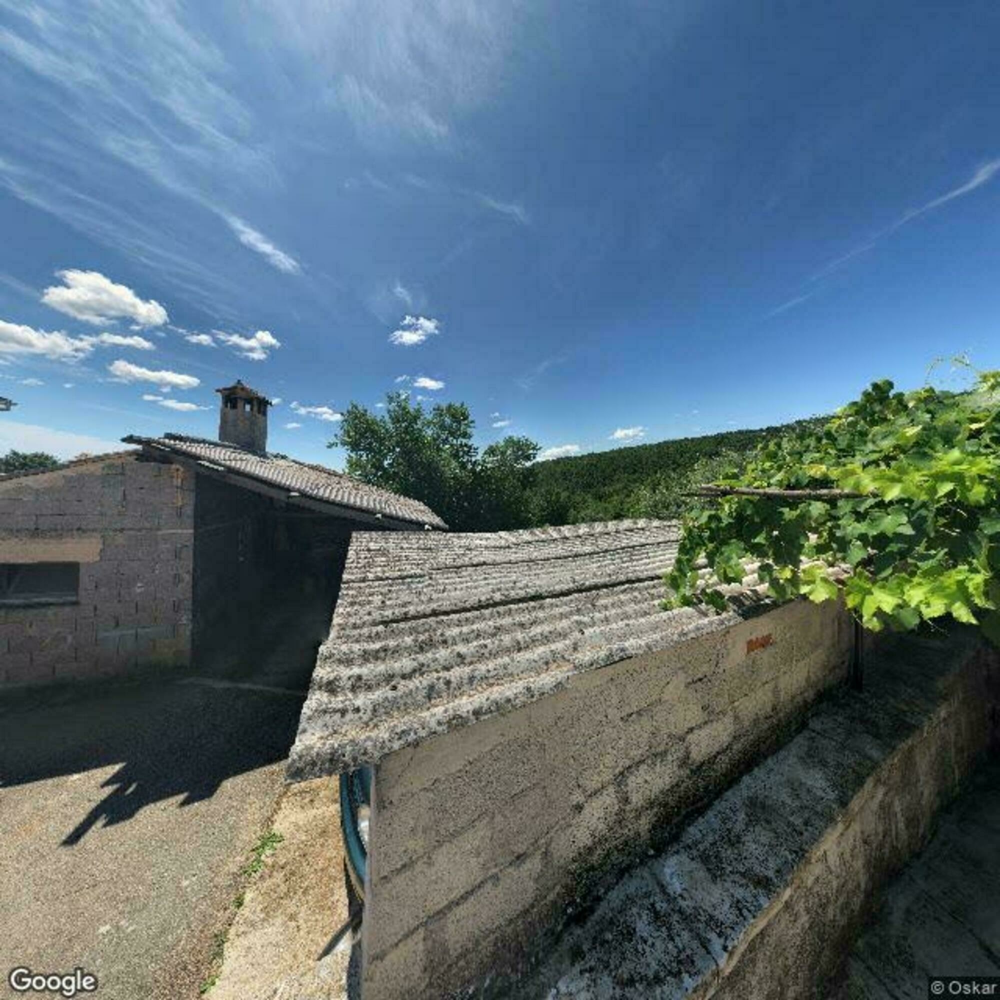
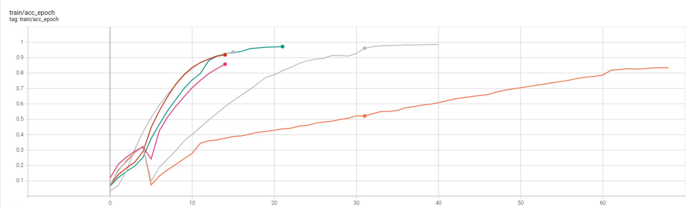
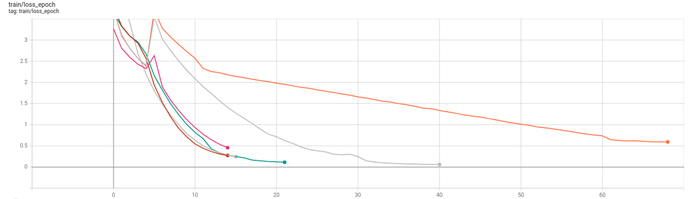
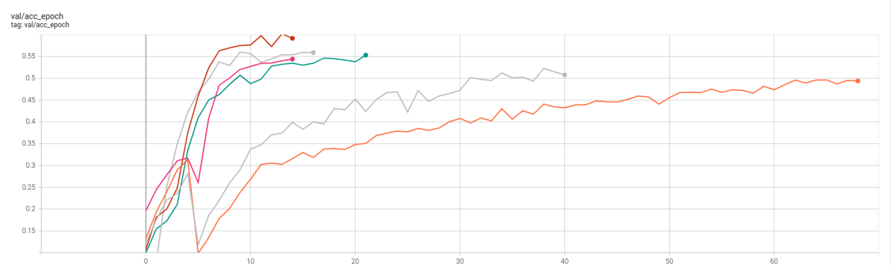
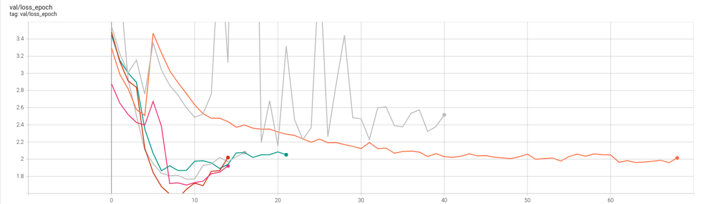
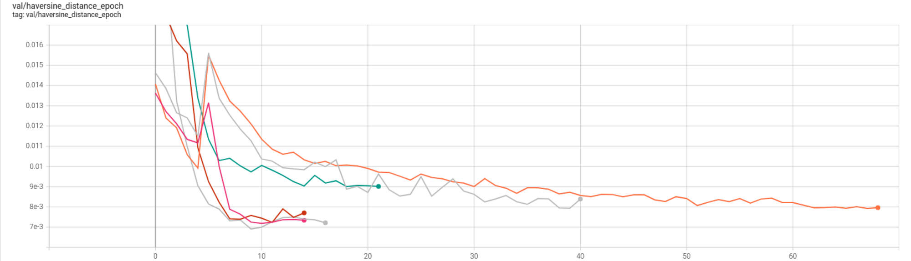

\pagebreak

# The Problem

## Introduction

Most of use know and love the famous online game [_GeoGuessr_](https://en.wikipedia.org/wiki/GeoGuessr). You are dropped in the middle of nowhere in [_Google Street View_](https://www.google.com/streetview/) and tasked with determining your location as closely as possible. “Am I on the North or South Pole?”, “Is this the African or South American jungle?” and “On which end of Russia am I?” are only some of the questions players ask while playing the game. Fortunately, the problem we were tasked with is a little simpler (keyword: _a little_). Instead of playing GeoGuessr on a global scale, we play it only within Croatia. However, we won't be _actually_ playing GeoGuessr, rather, we will do our best to create a machine learning model which will determinate the location. [Photomath](https://photomath.com/en/), the sponsor of this competition, provided us with a **train set** of Google Street View images taken on Croatian roads along with their coordinates. The images come in quadruplets forming a non-continuous 360° view of the location, where each image was taken in a cardinal direction (north, south, west, east) from the perspective of the Street View car. Alongside the images themselves, we also received their locations in the form of latitude and longitude pairs for each set of four image. An example of the four images is displayed in Figure 1.

{width=25%}
{width=25%}
{width=25%}
{width=25%}

\begin{figure}[!h]
\caption{Example of an instance of the dataset. Each instance is composed of four images, each facing a cardinal direction. Example location latitude: 45.131946, longitude: 14.002129}
\end{figure}

## The Task

As we previously stated, our task is to predict the coordinates of the images, specifically, the coordinates of the images from the **test set** which we will receive in the last week of the competition (kept of course in the most secret government bunkers, shut away from our prying eyes). It's important to note that we will not receive the true coordinates for the images in the test set. After we provide  predicted coordinates for each location from the test set, the total error is measured using the [**great-circle distance**](https://en.wikipedia.org/wiki/Great-circle_distance) between the predicted and true coordinates. The great-circle distance measures the distance between two points over a curved surface, e.g. the distance between two cities on the Earth’s curved surface, and it uses the [_haversine formula_](https://www.igismap.com/haversine-formula-calculate-geographic-distance-earth/) to do so (fortunately for you, we won’t go into detail about this). Total error is calculated as the mean of all great-circle distances between the true and predicted coordinates for all locations. It's also possible to explain this error in the following way: the further a bird needs to fly from the predicted coordinates to the true coordinates, the larger the error. The total error will be used to determine how successful one method is compared to others.

 through the sphere.](img/The-great-circle-distance-between-origin-and-destination.png){ width=50% }


# Solution

## Computer vision

The data we were provided with is in the form of images (as well as coordinate information, but that’s not training data). When trying to solve problems which in some way revolve around images as the main source of data, the method used to find a solution will most likely come from the field of [**computer vision**](#computer-vision). Computer vision is an area of research that has arguably seen the most growth from the advent of deep learning, being right up there with with meaningless buzzwords and sketchy venture capital funds. Over the past decade, it grew from a niche research area to one of the most widely applicable fields within machine learning. Nowadays in computer vision, we use neural networks to analyze a large number of images, extract some potentially useful information from them, and use that information to classify those images into predefined classes or predict a target variable. It’s a field of research with a very wide spectrum of applications, ranging anywhere from detecting traffic sings for self-driving cars to distinguishing fake works of art from real ones. The problem we were tasked with solving in this competition falls neatly into this category. And indeed, we will also apply methods and knowledge from the area of computer vision to solve our problem.

On paper, the problem sounds fairly simple and is not unlike many other computer vision tasks. However, we are faced with the following problem: a country can look very similar over large swathes of land. Turns out, the grass is green and the sky is blue wherever you are in the world. For example, if we were randomly placed somewhere in the area of [Slavonia](https://www.google.com/maps/@45.4743188,17.5110713,8.75z) and were told to determine where we are located exactly, it might feel impossible to predict our exact (or even approximate) location (the unending flatness of the region might give us a clue though). Unless we’ve already seen the landscape or we notice some obvious features of the location, such as a town sign or a famous landmark, there is little chance for us to correctly predict our whereabouts. There is a silver lining to this though. Croatia, although small, is very geologically and culturally diverse (thank you centuries of non-independence). Due to this, mountains, houses, forests and even fields can look different depending on the region of the country, giving precedence to the idea that the model could learn to spot these differences. That being said, it is nonetheless a difficult problem to solve and requires clever feature engineering and a careful neural network setup in order to work, which we will talk about in the coming chapters.

### Convolutional Neural Networks

What makes computer vision distinct from other fields of deep learning is its usage of **convolutional neural networks**. The main assumption that convolutional neural networks (from now on, CNNs) have is that our data (images) has composite structure. This fancy term is just a way of saying that the data we are working with is structured in a way in which larger parts are composed of smaller building blocks. For example, a Google Street view image might contain objects such as a house, a road, a car and a tree. When looking at a house, it contains a front door, windows, a facade and a chimney. Similarly, the front door contains a knob, a small glass window, a house number, etc. This composite structure assumption is important because of how CNNs work: they also have such a hierarchical structure. They are made up of multiple interconnected layers where each layer is in charge of extracting either high, medium or low level features from the images. For instance:

1. the first layer would learn how to recognize low level features - basic geometric shapes like lines and contours
2. the second layer would learn how to recognize medium level features – objects we can recognize like doors, windows, a facade and chimney
3. the third layer would learn how to recognize high level features – large and distinct image objects like houses, roads, cars, trees, etc.

Before continuing our tour of CNNs, let's first ask ourselves the following question:

> Why should we use CNNs for computer vision problems? Why can't we turn the 2-dimensional image data structures into 1-dimensional vectors of length `n * m` (`n` and `m` being the image height and width respectively) and feed it into an already existing model like linear regression or an SVM?

We _can_ do this, and this has been done for years prior to the advent of CNNs, but we really _shouldn't_. Why? Because by doing this, we lose a lot of object relation information in images, which are inherently 2D. This presents us with the following issues:

1. The method isn't robust to even slight differences in images that may otherwise appear very similar to the human eye
2. using images that were turned into 1D vectors for training requires _a lot_ more images compared to CNNs in order to predict the location of never before seen images.

The capacity of a model to successfully predict values (in our case coordinates) of unseen images is called **model generalization**. It can also be described as a model's ability to adapt properly to new, previously unseen data, drawn from the same distribution (in our case the distribution of Google Street view images in Croatia) as the data the model was trained on. The key takeaway here is that CNNs generalize better than simpler models, such as SVMs, for 2D data in the form of images.

Each layer in CNNs uses 2D _filters_ to capture image features. A filter is a 2D matrix where each element has it's own learnable weight. It slides across images to detect patterns it learned. You can think of it like a magnifying glass that slides across the image. Ideally, each filter in a CNN layer would specialize in learning different image features. By stacking multiple layers of these filters, each layer can learn a higher order of abstraction of the image data. For instance, the first layer might only learn to recognize simple lines. The second layer might combine these lines into shapes, while the third layer could finally combine these shapes into something recognizable, like a car. Such an architecture mimics how the human brain actually recognizes objects, that is to say, by combining smaller elements we see into larger ones. After we have stacked enough convolutional layers for recognizing objects, we finish off the network by feeding all the results into a fully connected layer for classification or regression and train it with any generic loss function.

A large advantage of CNNs compared to other network architectures is their interpretability. The filter weights can be visualized to depict what each filter detects in an image, while network weights depict how the filters are combined. This can help us in understanding how the network learns from images. This is exemplified in Image 3.

{width=50%}


## Data and Feature Engineering

The dataset we received is composed of a directory with images and a `data.csv` file. The images directory is quite simple. It is composed of numerous subfolders named with unique identifiers where each folder contains four images taken in the same location. The `data.csv` is slightly more complex and we will explore it a bit further. For starters, it looks something like this:

| uuid                                 | latitude          | longitude         |
| ------------------------------------ | ----------------- | ----------------- |
| 69387a76-b6f6-4a76-9d82-59367e14cb12 | 45.55222786237915 | 18.53839695354916 |
| 83fd0354-8781-4325-9139-653ba0ce718f | 45.11632629078026 | 14.82181715265881 |
| 5e2f692d-a2e6-45b1-b18b-3cec90b31b64 | 45.42498633931014 | 18.76785331863612 |
| b3447ea2-8ea2-4c4e-b2a8-8611c8253995 | 46.15450138396207 | 17.0570928956176  |

The `uuid` column is filled with IDs that represent the previously stated directory name. For each folder, we also have a specified `latitude` and `longitude` of the images contained inside. That being said, we made numerous modifications to this file ourselves, which we will describe in more detail in this chapter. We will call this new modified CSV file a _statically enriched csv_. An example can be seen in the following table:

| uuid  | lat   | lon   | poly_idx | center_lng | center_lat | crs_y      | crs_x      | crs_center_x | crs_center_y |
| ------------------------------------ | ----- | ----- | -------- | ---------- | ---------- | ------- | ------- | ------------ | ------------ |
| uuid1 | 45.55 | 18.53 | 45.0     | 18.74      | 45.64      | 5531731    | 159131     | 5542646      | 175076       |
| uuid2 | 45.11 | 14.82 | 25.0     | 14.74      | 45.14      | 5482666    | -132009    | 5486160      | -137869      |
| uuid3 | 45.42 | 18.76 | 45.0     | 18.74      | 45.64      | 5518068    | 177432     | 5542646      | 175076       |
| uuid4 | 46.15 | 17.05 | 50.0     | 17.21      | 46.11      | 5596833    | 43038      | 5592979      | 55064        |

Another thing that was of interest to us was the visual inspection of the distribution of the locations. Understanding the distribution of the data can give us insight into things we might not be aware of.

{width=50%}

## Data Representation

Because Croatia is such a small country (though not as small as Slovenia) and its coordinates have a range of no more then a few degrees in both latitude and longitude, we needed to normalize them. But, before doing that, there was another transformation we needed to perform. The thing is, we can’t use the haversine distance function during the training phase of the model due to its slowness (it contains a lot of trigonometric operations that don’t cooperate nicely with GPU-s). But we also can’t use regular coordinates even after transforming them because the Earth’s surface is curved (even though some would want you to believe otherwise) and generic loss functions don’t take this into account. Coordinates that are expressed as a latitude and longitude pair in degrees live in the [ESPG:4326](https://en.wikipedia.org/wiki/EPSG_Geodetic_Parameter_Dataset#:~:text=EPSG%3A4326%20%2D%20WGS%2084%2C,including%20Google%20Maps%20and%20OpenStreetMap.) latitude/longitude coordinate system that's based on the Earth's center of mass. This coordinate system is unsuitable as input our our model, but before explaining why, we have to mention that the ESPG:4326 space is what is called a **global space**. This will be useful later on. Now, back to explaining the issue, the drawback of space represented as coordinates is that the straight path distance (a.k.a "digging a tunnel", a.k.a the Euclidean distance) between two coordinates doesn't scale well on large distances. For example, a straight path distance between the locations (lat: 10, lng: 0) and (lat: 20, lng: 0) isn't the same as the distance from location (lat: 20, lng: 0) to (lat: 30, lng: 0). Sure, you may think that, Croatia being small, it won’t affect the results, but it does make a difference in the end. So in order to fix it, **we need a simple system of `x` and `y` coordinates in 2D Euclidean space on which we can use straight path distance without remorse!** Multiple ideas were tested to solve this, including cosine transforming the coordinates, as well as projecting them into a Cartesian coordinate system of three coordinates. Finally, we ended up using a much more elegant solution with fewer steps: the [_coordinate reference system (CRS) projection_](https://en.wikipedia.org/wiki/Spatial_reference_system). Here’s how it works. It transforms every coordinate on Earth’s curved surface into a different coordinate on a flat surface (2D Euclidean space) using a projection. In other words, a latitude and longitude pair is transformed into a `x` and `y` pair. A wonderful thing about the `x` and `y` coordinates is that they are expressed in terms of meters and that the error of projection applied on Croatia is minimal (no more than about 1m). Maybe most importantly, a generic [mean squared error](https://youtu.be/Mhw_-xHVmaE) loss function is directly applicable to these coordinates, or at least, the standardized version of them. The exact name of the new space is called [ESPG:3766](https://epsg.io/3766) which we will refer to as **Croatia CRS space**, tailor made for projecting Croatia's latitude and longitude coordinates into `x` and `y` coordinates which live in 2D Euclidean space.

Splendid! Now we simply need to find the maximum and minimum coordinates of the train dataset and use them to normalize the data into a 0 – 1 range. This is done to improve training stability and simplify the output. It is worth noting that we calculate these values only on the training part of the dataset, as using other parts of the dataset would essentially give the model access to their information, which wouldn’t be fair at all. This is is called [_data leakage_](https://machinelearningmastery.com/data-leakage-machine-learning/). Since our model will be outputing coordinates in the Croatian CRS space, we need to re-project them back into the global space so we can properly calculate the great-circle distance. A degrees to radian transformation is one more transformation that we need to apply since functions, such as the haversine distance function, take radians as input.

, the dataset we were provided with doesn’t include any Street View images taken on islands.](./img/croatia.png){width=50%}

## Classification Approach

The problem of predicting coordinates given four Google Street View images can be approached from two different angles. Fearing encroaching on any originality, we will call them the **Classification approach** and the **Regression approach**.

In the Classification approach, we classify images into a fixed set of regions of Croatia in the form of a grid on the map (notice: we lose the information about the image's exact location here), while in the regression approach we try regressing the image coordinates to a continuous output from the model that will be restricted by the minimum and maximum possible coordinates (bounds of Croatia).

The set of regions of Croatia we mentioned above can be represented in the form of square regions on a map. Each region corresponds to a single class and each region also has a centroid that represents the coordinates assigned to the class. The idea is that, instead of predicting the _exact_ coordinates of an image, the model classifies the images into regions from the previously described set of regions (Figure 6). Notice that we don’t directly predict the coordinates for each set of four images, rather, we predict the class (region) of Croatia the images belong in. However, due to the way the competition is set up, at some point we do have to provide a concrete value for the latitude and longitude coordinates. How will we decide on these coordinates? We declare the predicted coordinates to be the **centroid of the predicted region**. This centroid will be used to calculate our error in regards to the true coordinates. Notice that the image's true coordinates might be relatively distant from the centroid of the region into which the image was classified. This error shrinks as the number of specified regions (classes) grows.

{width=50%}


### Class Creation

How is this grid-like set of regions created? First, we create a generic grid that is located fully inside the bounds of Croatia. It contains numerous regions (squares) which are adjacent to each other. Although we are working with a fixed number of regions, not every region is created equal. This is because, unfortunately, some of them aren’t located in Croatia at all, as they don’t really intersect Croatian territory. Therefore, they shouldn’t be taken into consideration further on and are filtered out. After this is done, we proceed to the task of finding the centroids of these regions. Using the [`geopandas`](https://geopandas.org/en/stable/) library, this problem can be reduced to a single simple Python property: `region.centroid`. Great! Now we have a set of classes for our model. But before we continue the journey let us double-check what we did so far ...

### Problems That Arise

Let us observe the following example. Even though the centroids of the regions were calculated correctly (they’re in the center of the squares), some of them decided to go sailing and ended up in the middle of the sea. This doesn’t make sense for our prediction, as we know for a fact that the dataset contains images only taken on land. This has to change. Therefore, we introduce _clipped centroids_. Clipped centroids are a modification of regular centroids that fix the previously stated issue by clipping the undesirable centroid to the closest possible point on land. By doing this, we reduce the error rate of the model by moving seaborne centroids closer to the image’s true coordinates, which are on land.

{width=50%}

We have previously mentioned that it's possible to specify the number of classes we desire before creating the grid and thereby make it more or less dense. By choosing a dense grid, we can essentially simulate something akin to regression. This is because, as the number of classes increases and the size of each class decreases, more regions and centroid values are available as potential classes. A smaller class means that the theoretical maximum distance between a class’ centroid and the true image coordinates is also smaller, and therefore has the potential of decreasing the total prediction error. Note that, at the end of the day, this is what matters, not the accuracy of our class predictions, because we calculate the final error by measuring the distance between an image’s coordinates (here the class centroid) and its true coordinates. Even if we classify all images correctly, we will still have a potentially large average haversine distance because we never actually predict the true image coordinates, only the class centroids. If we take this to the extreme, which is an infinite number of classes, we can come quite close to regression, but there is a caveat. In classification models, each class needs a certain number of images to effectively train. If this number is too low, the model simply can’t extract enough meaningful information from the images of a class to learn the features of that class.

{width=33%}
{width=33%}
{width=33%}
\begin{figure}[!h]
\caption{Example of maps of Croatia divided into distinct regions that represent classes. Red dots represent the centroids of the regions, or otherwise, the point on land closest to the centroid if the centroid is at sea. The number of regions are, from left to right, 20, 55 and 115}
\end{figure}

Another problem arises because of Croatia’s unique shape, only matched by that of Chile and The Gambia. For some regions, the intersection area with Croatia's territory is only a few tiny spots, meaning that the majority of the region's area ends up in a neighboring country. If this was anywhere before 1991., this wouldn’t be a problem, but it isn’t. The usage of clipped centroids we previously defined somewhat alleviates this issue, but another problem arises because there simply might not exist any images in the dataset that are located in that tiny area of the region, that is, within Croatia. And in fact, we did end up in such a situation. We solved this by discarding these regions and pretending like they didn't exist in the list of classes we could classify the images into. Fortunately, this doesn’t happen too often as the dataset is fairly large and the image’s locations are uniformly distributed.

In the later stages of this project, we had an Eureka moment. Why do we have to declare a centroid (clipped or not) as the final coordinate of the region? What if the geography of a class is hostile to cars, for instance a a mountain, or even worse, Split? However well prepared, the little Street View car would have issues traversing some of these areas. Just look at an area such as [Lika](https://www.google.com/maps/@44.7471723,15.2368329,9.25z/data=!5m1!1e4). Due to this, we expect more Google Street View images to come from a more car friendly part of the region. To take this into account, we created **weighted centroids** for each region. Weighted centroids are calculated as the average location of all images in a specific region. Worth of note is that only the images from the train set were used in this process (remember the number one enemy of every well reproducible deep learning model: data leakage).

{width=50%}

### Loss Function

Lastly, as with most classification approaches, we use [cross entropy loss](https://www.youtube.com/watch?v=6ArSys5qHAU) on the predicted and true classes. We will try to explain this concept using the following text extracted from the Deep Learning Holy Book:

> Thus spoke the Cross Entropy Loss to the Model: "Thou shalt classify the Images of God into a region worthy of The Creator!"
>
> And the Model responded in abandon: "Alas, is the Image not only a part of many, as the flock of our Lord is plentiful? Only by measuring its membership to all before God, shall the true nature of Class be shown in full light ..."
>
> Cross Entropy, with fire in its eyes: "No! It is not in the name of our Lord to be indecisive. Thus, you shall be punished for your Sins! But, you shall only account for the Sins of the Class you truly belong to."
>
> And the Model understood his part: "Alas, if what you say is not in vain, then these two Sins shall be punished equally before God: [0.6, 0.3, 0.1], [0.6, 0.2, 0.2], am I not right?
>
> Cross entropy, joyous to have led another sheep to the flock: "You speak the truth, my friend. But heed my word! Do not take these gifts of God as given. Only one who is truly without Sin and turns a 0.6 into a 1 shall win in the Grand LUMEN Tournament and be granted eternal glory before God."

- Letters to the Computer Scientists, 0:9

The true classes are represented with a one-hot encoded vector ([1, 0, 0]), while the predicted classes are represented with a vector of probabilities for the likelihood of each class ([0.6, 0.3, 0.1]). Now that we have probabilities for each class/region, how do we obtain the final coordinates? Firstly, we extract the centroid from all classes. Then, we multiply the centroids with the corresponding probabilities. You can think of the probabilities as weights in this context. Finally, we add everything up and end up with a [weighted arithmetic mean](https://en.wikipedia.org/wiki/Weighted_arithmetic_mean). Notice that our final predicted image coordinate is not necessarily within our predicted class, but as our model becomes more sure in its predictions, so do these averaged coordinates come closer to their true class. We have noticed that this averaging approach improves performance.

## Regression Approach

This approach is a bit more obvious. Each set of images has its target coordinate, and we task our model with predicting these coordinates. Therefore, the size of the output of the model is not determined by the number of classes, but is simply two, accounting for the latitude and longitude (or to be precise, the standardized versions of the `x` and `y` coordinates from the Croatian local space). We directly compare these output coordinates to the true image coordinates and calculate the distance (error) using mean squared error. This distance is almost exactly the same as the haversine distance between two coordinates in the global space. Unlike in the classification approach, the loss function we use here can also tell us an accurate state of our predictions, as we are not bound by an artificial limit like having classes. That being said, in practice, we noticed that regression often performs worse than the classification approach and is also slower. It appears that the presence of classes does help the model in training somewhat. Regression might perform better if we were patient enough to train the model for more than a few days. 

### Loss Function

For the loss function, we use mean squared error loss and we predict the coordinates directly. After we obtain the predicted coordinates we re-project them back into global space and calculate the haversine distance for the purposes of logging and statistics. It is worth noting that these two approaches, classification and regression, can only be compared using the haversine distance metric, as their loss functions work in very different ways and output vastly different values. Therefore, they can’t be compared during training, but only during validation and testing, because we calculate the haversine distance value only then.

## Technology Stack

Before diving into the architecture of the solution, the technology stack we used will be described briefly.

- [`python3.8`](https://www.python.org/) - the main programming language used for the project, everyone and their mom uses it so no explanation needed here
- [`git`](https://hr.wikipedia.org/wiki/Git) - the quintessential version control system

Some of the Python packages we used:

- [`PyTorch`](https://pytorch.org/) - an open source deep learning framework based on the Torch library used for applications such as computer vision and natural language processing. Although it is primarily developed by Facebook's AI Research lab, we can assure you that it does not collect any data from your computer
- [`PyTorch Lightning`](https://www.pytorchlightning.ai/) - a PyTorch framework which allowed us to skip a lot of boilerplate code and organize PyTorch code in a sensible and efficient way
- [`black`](https://github.com/psf/black) - code formatter, so we’re all on the same page (pun intended)
- [`aiohttp`](https://docs.aiohttp.org/en/stable/) - Asynchronous HTTP Client/Server for asyncio and Python. Used for sending/receiving asynchronous requests when calling Google's Street View API. Thank you for letting us download a ton of images.
- [`Pandas`](https://pandas.pydata.org/) - the popular Python data analysis library. Used for loading, managing and decorating *.csv files
- [`geopandas`](https://geopandas.org/en/stable/) - Pandas version used for geospatial data. Used to wrangle, manage and generate geospatial data
- [`imageio`](https://imageio.readthedocs.io/en/stable/) - write and read image files
- [`isort`](https://github.com/PyCQA/isort) - sort python imports
- [`matplotlib`](https://matplotlib.org/) - data visualization with Python
- [`NumPy`](https://numpy.org/) - mathematical functions and management of multi-dimensional arrays. Does anything even run without this?
- `requests` - a HTTP library for Python. The goal of the project is to make HTTP requests simpler and more human-friendly
- `scikit-learn` - a free machine learning library for Python. It features various classification, regression and clustering algorithms
- `Shapely` - package for manipulation and analysis of planar geometric objects. It is based on the widely deployed GEOS (the engine of PostGIS) and JTS (from which GEOS is ported) libraries
- `tabulate` - easy and pretty Python tables
- `tensorboard` - library used for fetching and visualizing machine learning model training data in a browser
- `tqdm` - easy Python progress bars

## Solution Architecture - [PyTorch Lightning](https://pytorch-lightning.readthedocs.io/en/latest/starter/introduction.html)

The core library used for this project is PyTorch Lightning (PL), first developed by [William Falcon](https://www.williamfalcon.com/). You can glance through it's [introductory website](https://pytorch-lightning.readthedocs.io/en/stable/starter/introduction.html) to get a good sense of what PL actually does. PL doesn't introduce significant complexity to existing PyTorch code, isntead, it organizes the it into intuitive PyTorch Lightning modules. Examples of how it does this can be seen [here](https://pytorch-lightning.readthedocs.io/en/latest/starter/converting.html). It's important to note that the main component, the [`LightningModule`](https://pytorch-lightning.readthedocs.io/en/stable/common/lightning_module.html), is inherited from [`torch.nn.Module`](https://pytorch.org/docs/stable/generated/torch.nn.Module.html) but with added functionality, making it entirely compatible with regular PyTorch. It’s also worth noting that PL passively forced us to write clean code with smaller overhead (compared to raw PyTorch code) and allowed us to quickly add crucial functionalities like logging, model checkpoints, general prototyping, and more. Kudos to the [PyTorch Lightning team](https://www.pytorchlightning.ai/team) for creating, maintaining and improving this great library.

To get a sense of how PL organizes code, we will show a simplified version of our `pl.LightningModule`:

```py
# examples/litmodel.py
```

(optional) you can quickly glance over Key PL modules:

1. [`pl.LightningModule`](https://pytorch-lightning.readthedocs.io/en/stable/common/lightning_module.html) - LightningModule organizes your PyTorch code into 6 sections:
   1. Computations (init)
   2. Train Loop (training_step)
   3. Validation Loop (validation_step)
   4. Test Loop (test_step)
   5. Predicti3on Loop (predict_step)
   - this is also where the actual **model** is created
2. [`pl.DataModule`](https://pytorch-lightning.readthedocs.io/en/latest/data/datamodule.html) - datamodule is a shareable, reusable class that encapsulates all the steps needed to process data:
   1. Download / process the data (for example from a website or CSV file)
   2. Clean and (maybe) save to disk
   3. Load the data into `Dataset`
   4. Initialize transforms (rotate, resize, etc…) that will be sent to `Dataset`
   5. Wrap `Dataset` inside a `DataLoader`. `DataLoader` will be returned to the `Trainer`.


3. [`pl.Trainer`](https://pytorch-lightning.readthedocs.io/en/latest/common/trainer.html) - once you’ve organized your PyTorch code into a `pl.LightningModule`, the `pl.Trainer` automates everything else:
   1. Automatically enabling/disabling grads
   2. Running the training, validation and test dataloaders
   3. Calling the Callbacks (logging, model checkpoints, learning rate scheduling...) at the appropriate times
   4. Putting batches and computations on the correct devices

### GeoguesserDataset ([src/dataset_geoguesser.py](../src/dataset_geoguesser.py)) - The Pawn

The `GeoguesserDataset` module is responsible for lazily fetching images and their coordinates during training. We initialize it three times in total (for training, validation and testing). Now, each of the three `GeoguesserDataset`s is responsible only for fetching the data from it's corresponding dataset. For example, the `GeoguesserDataset` with the parameter `dataset_type` set to `DatasetSplitType.TRAIN` will only return the images from the train set. The most important operation that the `GeoguesserDataset` module performs, aside from defining from which dataset the images are fetched, is lazily fetching and passing the location and four images (one for each cardinal direction) to the `pl.Trainer` during the training, validation and testing phase. Essentially, this module answers the following question: "_Which data will I start sending out in batches once the training process is started_?"

It's also worth mentioning that any image or coordinate transformation is generally done inside of this module. What does this mean? Let's say we want to resize our original image, 640x640 pixels, to a size of 224x224 pixels. The model obviously requires more time to train on large images. Since this competition lasts a few months and not a few years (now THAT would be interesting), we generally resize our images to 224x224 pixels. Instead of resizing images stored on the disk, we can do this during training. And you might say "yes, wouldn’t it be faster to resize them in advance so that the program doesn't waste precious resources during training?". That's true, but the computation required to resize the image is negligible compared to other actions that occur during the training phase. Okay, so we settled on resizing the images during training. Now, who would be responsible for that? Exactly, that would be `GeoguesserDataset`. Before returning the images and their coordinates to the trainer which sends it further into the model, the `GeoguesserDataset` will apply resizing transformation on the images. In fact, any transformation can be specified before we create the `GeoguesserDataset` and that exact transformation will be applied before the trainer fetches the data. Examples of such image transformations, other than resizing, include cropping, translation, noise injection, color space transformations, and [more](https://journalofbigdata.springeropen.com/articles/10.1186/s40537-019-0197-0).

`GeoguesserDataset` inherits the [torch.utils.data.Dataset](https://pytorch.org/tutorials/beginner/data_loading_tutorial.html) class.

### GeoguesserDataModule (src/datamodule_geoguesser.py) - The Bishop

The `GeoguesserDataModule` is mainly responsible for two things:

1. preprocessing that can't be done by `GeoguesserDataset`. This preprocessed data is sent to the `GeoguesserDataset`.
2. creating train, val and test [`DataLoader`s](https://pytorch.org/tutorials/beginner/basics/data_tutorial.html#preparing-your-data-for-training-with-dataloaders), each for one `GeoguesserDataset`

We will first describe what kind of preprocessing actually happens here. `GeoguesserDataModule` will receive the CSV file which contains information about image's locations, regions in which they are placed. Then this CSV is enriched with new columns in advance, values which we would need to calculate during the training. For example, we create a new column `crs_x_minmax` which is the x coordinate in Croatia's local system scaled to [0, 1]. We mentioned how we exclude the regions that contain no image data. But how can we know this in advance? What if someone decides to add more images (like we did) in the sets and suddenly some region that was long forgotten becomes a viable option? This is why we create classes in `GeoguesserDataModule`, during the runtime. The weighted mean centroid of each region is also calculated here. We also perform some dataset statistics extraction, as well as data standardization for all CRS features. Finally, we split the data into the train, validation and test dataset and create the dataset instances that will be described in the next paragraph. We also do some sanity checking to make sure everything is in order before continuing. 
<todo: insert image of croatia, grid and each class and its number>

Great thing about this module is that it's dynamic in terms of defining the size of the dataset. Parameters that define the fraction each set (`train_frac`,`val_frac`,`test_frac`) or the dataset as a whole (`dataset_frac`) turned out to be quite useful during the prototyping phase of the problem solving. Although you almost always want to use all your available data (`dataset_frac = 1`) it's nice to have options too.

`GeoguesserDataset` inherits the [`LightningDataModule`](https://pytorch-lightning.readthedocs.io/en/stable/extensions/datamodules.htm) class.

### LitModelClassification (src/model_classification.py) or LitModelRegression (src/model_regression.py) - The King

The convolutional neural network model that is going to perform the training is defined in the model module. The different models we defined here (classification and regression) all inherit the `LightningModule` class to make things as simple as possible. Each model fetches a pretrained network and changes its last layer to a layer more suitable for the model’s task. We then define each model’s `forward` function, which defines how our data is processed through all the layers of the model, as well as define and all of the training, validation and testing functions. Each function performs an iteration of training through its respective dataset and calculates error, and additionally in the case of validation and testing, the haversine distance function. We then log all the parameters of the model into a file for later fetching and usage.


#### Forward function - The King 
<Todo: populate this>

### Train Function - The Queen

Finally, we join everything together in the `train` function. Here, we parse the arguments passed to the model, define the data transformations, initiate the `GeoguesserDataModule` module, initiate the logger, create the specified model, define our optimization algorithm and how the learning rate behaves, and finally, train the model. Optionally, we can also visualize our results after training.

### Optimizers and LR Schedulers (configure_optimizers) - The Rooks

Our solution is composed of four main modules, as well as numerous utility functions. Utility functions were mainly used for tasks that were separate from the training process itself, such as transforming data into a format appropriate for training, geospatial data manipulation, visualization, report saving and loading, etc. Even though we love our utility functions which are crucial to this project, they are generally responsible for lower level work which isn't the focus of this project. Here, we will promptly ignore them and explain only the higher level components of our solution, namely, the four main modules.


# Model

## Pretrained networks

Because deep learning progresses at such a breakneck pace, there are numerous approaches that are considered state-of-the-art at the moment, all using vastly different architectures. Because readily available high performance models that were pretrained on large datasets are the norm and us being extremely lazy, we chose to use one of these models instead of creating our own from scratch. The pretrained models are usually trained on large datasets (e.g. [ImageNet](https://www.image-net.org/)) which include many different types of images and classes. 

{width=30%}

Although solving a problem in which the content of images can be essentially anything seems extremely hard, a model that learns to generalize on these datasets can usually be _tuned_ to solve other problems that were originally outside of its domain (like predicting the location of images). This method of using the pretrained model to solve another problem is called [_transfer learning_](https://www.youtube.com/watch?v=yofjFQddwHE). The main advantages of fine-tuning when solving computer vision tasks are as follows:

1. the pretrained model already learned to generalize on key features of a very generic set of images, that is to say, general shapes that can be applied almost anywhere. Our model doesn't have to learn this again.
2. although this isn't a problem in our case since we have a fairly large dataset, using pretrained models is very robust on small datasets. Due to the model we use having much more parameters then there is data in our model, we can still appreciate this.

## ResNeXt

Originally, we chose the EfficientNet architecture due to it showing both good performance and having lower system requirements when compared to other approaches. However, for reasons we didn't bother to explore any more than we needed to, we consistently observed worse results and slower convergence of EfficientNet compared to the model we finally settled for. After some experimenting, we ended up using a version of ResNet called ResNeXt instead, as it simply proved more effective. It can easily be loaded into PyTorch with the following expression: `torch.hub.load("pytorch/vision", "resnext101_32x8d")`. 

ResNeXt is a highly modular architecture that revolves around repeating powerful building blocks that aggregate sets of transformations. It first processes the images with a simple convolution layer. It then feeds this into a sequential layer composed of multiple bottleneck layers. A bottleneck layer has the function of reducing the data dimensionality, thereby forcing the network to learn the data representations instead of just memorizing them. Each bottleneck layer is again composed of multiple convolution layers for information extraction. After the sequential layer is done, the network is fed into another sequential layer. This process is repeated multiple times. Finally, after all the sequential layers have processed their outputs, the data is fed into a fully connected layer for classification or regression. Of course, all of the mentioned layers also use numerous normalization techniques, such as batch normalization. This process is visualized in the figure below. Due to this modularity of the layers, ResNeXt includes few hyperparameters that have to be tuned for the architecture to be effective. Aside from the described architecture, we had to do some modifications to the network ourselves in order to make them work with our dataset. There were two modifications we made.

{width=50%}

## Modifications

Firstly, we removed the last layer of the network and replaced it with our own classification or regression layer in the form of a simple linear layer that had the appropriate output dimension for our problem. Secondly, because, as we mentioned before, every location contained four images, we modified our network to perform its forward operations for the four images in tandem and then concatenate the outputs before imputing them into the last layer. We did this after doing some research on what was the best way to compute the outputs of separate, but statistically linked images.

{width=50%}
{width=50%}
\begin{figure}[!h]
\caption{On the image on the left, we can see an overview of the model we used for training. Inputs are fed into the ResNeXt layer with four images being processed in parallel. The output is then fed into a linear layer which can either classify the results into distinct classes or predict coordinates directly as output. On the image on the right, a closeup of the ResNeXt backbone is shown. We can see that it is composed of an early convolution layer, followed by multiple sequential layers who all contain their own convolutions and transformations.}
\end{figure}

| Name | Type               | Params            | In sizes | Out sizes        |
| ---- | ------------------ | ----------------- | -------- | ---------------- | ---------------- |
| 0    | backbone           | ResNet            | 86.7 M   | [8, 3, 112, 112] | [8, 2048]        |
| 1    | backbone.conv1     | Conv2d            | 9.4 K    | [8, 3, 112, 112] | [8, 64, 56, 56]  |
| 2    | backbone.bn1       | BatchNorm2d       | 128      | [8, 64, 56, 56]  | [8, 64, 56, 56]  |
| 3    | backbone.relu      | ReLU              | 0        | [8, 64, 56, 56]  | [8, 64, 56, 56]  |
| 4    | backbone.maxpool   | MaxPool2d         | 0        | [8, 64, 56, 56]  | [8, 64, 28, 28]  |
| 5    | backbone.layer1    | Sequential        | 420 K    | [8, 64, 28, 28]  | [8, 256, 28, 28] |
| 6    | backbone.layer1.0  | Bottleneck        | 118 K    | [8, 64, 28, 28]  | [8, 256, 28, 28] |
| 7    | backbone.layer1.1  | Bottleneck        | 151 K    | [8, 256, 28, 28] | [8, 256, 28, 28] |
| 8    | backbone.layer1.2  | Bottleneck        | 151 K    | [8, 256, 28, 28] | [8, 256, 28, 28] |
| 9    | backbone.layer2    | Sequential        | 2.4 M    | [8, 256, 28, 28] | [8, 512, 14, 14] |
| 10   | backbone.layer2.0  | Bottleneck        | 602 K    | [8, 256, 28, 28] | [8, 512, 14, 14] |
| 11   | backbone.layer2.1  | Bottleneck        | 601 K    | [8, 512, 14, 14] | [8, 512, 14, 14] |
| 12   | backbone.layer2.2  | Bottleneck        | 601 K    | [8, 512, 14, 14] | [8, 512, 14, 14] |
| 13   | backbone.layer2.3  | Bottleneck        | 601 K    | [8, 512, 14, 14] | [8, 512, 14, 14] |
| 14   | backbone.layer3    | Sequential        | 55.2 M   | [8, 512, 14, 14] | [8, 1024, 7, 7]  |
| 15   | backbone.layer3.0  | Bottleneck        | 2.4 M    | [8, 512, 14, 14] | [8, 1024, 7, 7]  |
| 16   | backbone.layer3.1  | Bottleneck        | 2.4 M    | [8, 1024, 7, 7]  | [8, 1024, 7, 7]  |
| 17   | backbone.layer3.2  | Bottleneck        | 2.4 M    | [8, 1024, 7, 7]  | [8, 1024, 7, 7]  |
| ...  | ...                | ...               | ...      | ...              | ...              |
| 37   | backbone.layer3.22 | Bottleneck        | 2.4 M    | [8, 1024, 7, 7]  | [8, 1024, 7, 7]  |
| 38   | backbone.layer4    | Sequential        | 28.7 M   | [8, 1024, 7, 7]  | [8, 2048, 4, 4]  |
| 39   | backbone.layer4.0  | Bottleneck        | 9.6 M    | [8, 1024, 7, 7]  | [8, 2048, 4, 4]  |
| 40   | backbone.layer4.1  | Bottleneck        | 9.6 M    | [8, 2048, 4, 4]  | [8, 2048, 4, 4]  |
| 41   | backbone.layer4.2  | Bottleneck        | 9.6 M    | [8, 2048, 4, 4]  | [8, 2048, 4, 4]  |
| 42   | backbone.avgpool   | AdaptiveAvgPool2d | 0        | [8, 2048, 4, 4]  | [8, 2048, 1, 1]  |
| 43   | backbone.fc        | Identity          | 0        | [8, 2048]        | [8, 2048]        |
| 44   | fc                 | Linear            | 434 K    | [8, 8192]        | [8, 53]          |

# Training

## Basics

Due to using pretrained models, we first performed what is called _fine-tuning_. During fine-tuning, we leave the weights of the early layers of a network unchanged and only train the weights of the last few layers. ResNeXt was pretrained on ImageNet, a large image dataset with a diverse assortment of objects. This gives the early layers of ResNeXt a collection of learned shapes and lines that are relatively similar to our own domain. In addition, our own dataset is much smaller than the number of ResNeXt parameters. If we were to train ResNeXt from scratch, we would quickly overfit. By using a model pretrained on a large generic dataset and then fine-tuning only the last layers, we preserve all the fine detail learned by all the early network layers and only overwrite the last layers where we essentially assemble these details into images. However, after performing fine-tuning for a sufficient number of epochs, we unlock other network layers so that they can be trained along with the last few layers. During this phase, by using a sufficiently small learning rate, we induce our dataset information into all the network layers without overwriting the previously trained model.

## Dataset

As previously mentioned, the dataset is divided into two components. The first one is a collection of folders each containing four images taken in the same location. Each folder is named with a unique identifier. The second component is a CSV table where each row contains one of the previously mentioned folder IDs and the corresponding image’s latitudes and longitudes expressed in degrees. We divided the data by hand into a training, validation and testing subfolder in a 80%/10%/10% split (for some models, it was 90%/5%/5%). This way, the data could be easily loaded during the training process from the appropriate folder depending on if we are in the training, validation or testing phase. Due to the datasets (and image’s) large size, we were unable to load the whole dataset directly into memory (we only had a _measly_ 12 GB of VRAM available on our GPU). We wanted to do this because it had the potential of greatly decreasing training times, but we were forced to figure out other methods of speeding up training, like using only parts of the dataset during experimentation and employing smarter learning rate schedulers.

Before the training process itself could begin, we needed to first process the data to make it more suitable for training. This entailed modifying the CSV file to include data such as class affiliation, class centroid information and the image’s and centroids latitude and longitude information in CRS format. Aside from this, image information such as the minimum and maximum value of each channel had to be also stored for fetching during the training process, and later, inference.

For the competition, we were provided with a dataset of around 64 000 images (16 000 separate locations of four images each), but we added our own separately procured images from Google Street View numbering around 68 000. In other words, we doubled the available data for training. In common deep learning wisdom, having more training data is the best form of regularization, this being our main guideline for gathering additional images.

## The Model Training Phase

### Training

The algorithm was composed of 3 steps. In the first step, the algorithm goes through the training dataset in batches of a specified size (usually 8, more if memory constraints allowed). The training step had to be as quick and efficient as possible because time- and processing-wise, it entailed the vast majority of the learning phase. Due to this, the haversine distance of the true and predicted image coordinates wasn’t calculated here. This not only let us skip the time consuming process of calculating the haversine distance itself, but also avoided the costly transformations of the data necessary for converting it to a format suitable for input into the haversine distance functions.

### Validation

After we exhausted the training dataset (normally called an epoch), we validate our progress on the validation part of the dataset. This is done to prevent overfitting, which we will explain in more detail. As the model learns on the training dataset and if the model is of a sufficient size, i.e. it has more learnable parameters than there are images in the data, it will essentially memorize all the information in the training dataset by heart and learn how to predict it perfectly. However, because it has never seen the data in the validation dataset before, it will predict it correctly only if it has a good generalization capacity, that is to say, it can apply its knowledge on previously unseen data. Aside from this, the validation dataset allows us to finally calculate the haversine distance for the predictions, which is the most accurate (and only true) measure of our current progress, as well as the final performance of the model. It is worth noting that during the validation process, learning is disabled, as the model’s trainable parameters are “frozen” here. Another thing to note is that the validation phase also functions as a “checkpoint” for our model. The best performing iterations of the model on the validation dataset are saved for later to be used on the testing and inference datasets.

### Testing

Finally, after all the training epochs are over, meaning we went over both the training and validation dataset numerous times, we can test our model on the testing dataset. Just like the validation dataset, the test dataset has never been seen by our model before and is used as a final performance assessment. The best model found in the validation phase is used here. What makes the testing dataset special is that, during validation, we often change and test different values for hyperparameters. This is called hyperparameter tuning. During this process, some of the information from the validation dataset _leaks_ into the model, because we are essentially training the hyperparameters on the validation dataset. Due to this, at the very end, another test is performed on a separate, never before seen test dataset to create a truly unbiased performance assessment of our model.

## Hyperparameters

### Image and Batch Size

We set the image size to either 224x224, 112x112 or 56x56 pixels, depending on the model. A smaller image size allows for larger batches and faster training, but potentially contains less information in the images due to resolution loss. Batch size itself has the purpose of regulating how fast and accurate our training is. You see, perfect backpropagation (an algorithm which we are sure you know very well and we won’t explain for a millionth time) updates model weights only after going through all images in the entire training dataset. This usually results in the most accurate possible gradients for optimization, but has the downside of being very slow and often ending up in local optima. On the other end of the spectrum, training on only one image per batch is very fast and can easily escape local optima, but is also rather inaccurate and converges quite slowly due to imprecise gradients, especially in the later stages of training. The best of both worlds can be achieved by training on multiple images per batch, ideally as many as possible (actually, there is an upper limit to the number of batches one should use, but it is often infeasibly large). Memory and GPU limitations commonly don’t allow for this, so we are forced to use the largest batch size we can (8, to be precise, for an image size of 112x112 pixels). Lowering the image resolution can give us more wiggle room in choosing batch sizes, but setting batch size too a too large value runs the risk of quickly filling up the GPU’s memory and crashing the training process midway through.

### Learning Rate

Aside from image size and batch size, another important parameter to be adjusted is learning rate. A learning rate with a large value can converge the model to a solution quickly, but lacks fine tuning capabilities necessary for that extra edge in performance during later phases of training. On the other hand, a small learning rate can make the training process very slow and can cause it to often end up in local minima (in other words, learning rate has the opposite behavior of batch size). Ideally, we should have a large learning rate in the early stages of training, while periodically reducing it as the training moves on. The application of momentum can also help in this. Momentum is a value that is proportionally added to the learning rate during training if it is going particularly well. An optimizing algorithm that includes all of the aforementioned mechanisms is [Adam](https://arxiv.org/abs/1412.6980). We chose it due to its good balance between precision and speed during training, as well as its built in momentum function.

## Inference

Inference is performed after the entire training phase of our model is over. It is the process of testing our best performing model on never before seen images and can be described as the training phase in reverse: instead of seeing an image’s coordinates and training our model on them, we now have to look only at the image itself and predict it’s coordinates. The true image coordinates are hidden from us and are compared against our answers without us overseeing any part of the process. This is how our model will finally be tested and compared against other models in the end to assess its final performance. More about how this is done can be found in our Technical Documentation (TM).

# Results

In this chapter, we will describe the results of our model, mostly focusing on the different metrics we used. We tested numerous regression and classification models with a diverse set of hyperparameters, but we will mostly focus on the most successful ones. There are three evaluation metrics we used for classification and two for regression. We will also try to use as much visuals as possible to make this section less boring. Here we go.

## Training

The bulk of the model learning process is contained in the training process. Here, models would often reach near perfect classification and loss results which would translate to overfitting during validation. An example of these graphs is shown in Figure 13 and Figure 14.

{width=100%}

{width=100%}

We can see that there are three distinct groups in these graphs. The first one is the cluster of four models of similar performance, with quick training and high accuracy. However, the only thing they have in common is that they’re classification models and that they were trained on the same dataset. All their hyperparameters: image size, learning rate and number of classes are all different. However, this being the training part of the dataset, this doesn’t have to tell us much because on the train dataset, most models reach high performance and overfit, regardless of their setup.

The somewhat slower gray model in the middle is unfortunately a mystery to us, as at that time we didn’t quite track hyperparameters. We do however know that it contains 72 classes. But, as we can see, it also reached near perfect classification on the train dataset. Same goes for the orange model to the right in the graph, although that one is really slow.

The drop and subsequent recovery in performance that is observable in the earlier stages of training can be explained by the unfreezing of the remaining layers of the backbone. As we previously explained, we start the training process by fine-tuning the models and then unlocking the rest of the model layers for training. By doing this, we temporarily increase the loss of the model because the model needs some time to adjust the remaining layers correctly. But we can see that the models normally successfully recover from this and that it doesn’t have a large impact in final training performance.

## Validation

Validation is much more interesting to observe than training. It is much harder to reach good performance here and there is a larger difference between the individual models. The champions of generalization show their true colors here. We will examine three graphs here instead of two. They are shown in Figure 15, Figure 16 and Figure 17.

{width=100%}

{width=100%}
	
{width=100%}

We can immediately observe a few notable facts about these graphs. For starters, the accuracy graph looks very similar to the train version of the same graph. The dips in performance are still here and the general layout of the models is fairly similar. However, the cluster of graphs on the left side of the graph is now more flashed out, having more diversity between the results. We can see that the red line does stand out in terms of accuracy, showing that train results indeed don’t account for everything and a validation dataset is necessary. What makes this model somewhat stand out is its lack of a dip in performance. This could be explained by the later stage at which the backbone gets unfrozen (at epoch four instead of two for a lot of models), as well as its larger image size of 224x224 pixels. This isn’t the only model with the hyperparameters, but it is the only model with this exact combination, showing that extensive experimentation is necessary for finding optimal parameters and gaining an extra edge in performance.

The validation loss graph is very different from the train loss graph. What immediately grabs one’s attention is the erratic movement of the gray graph. We think that this occurred because of the early stage the model’s backbone was unlocked, coupled with a bad combination of other parameters. The very large dip in performance gives precedence to this, as the model also never really recovers from the dip. This again shows how the training performance can vastly differ from the validation performance.

Another thing we observe is that at a later point in training, most model’s validation loss starts increasing. This is a textbook example of overfitting. Even though the training model’s performance continues to increase, the validation performance starts suffering due to the model starting to memorize all the information from the training dataset.

Finally, we have to talk about maybe the most important graph here, the haversine distance graph. As we previously mentioned, haversine distance is the most accurate indicator of final performance, as it is what is measured on the final testing dataset. So, what can we observe here? In general, the metric behaves quite similarly to loss. When the loss graph starts overfitting, the performance in haversine distance also stagnates or even starts increasing a bit. The dips in performance after backbone unlocking are also here.

In general, we have noticed a few patterns. A larger image size seems to increase models performance, as does a larger number of classes. However, these parameters can greatly slow down training performance. Due to this, careful learning rate scheduling is crucial to both optimal performance and faster training times. Aside from this, we mostly set batch size to the largest one possible for our image size. Unfreezing at a later epoch after carefully fine-tuning the last layer also seems to increase performance, as doing this suboptimally can greatly hinder performance and sometimes even render the whole model unusable.
